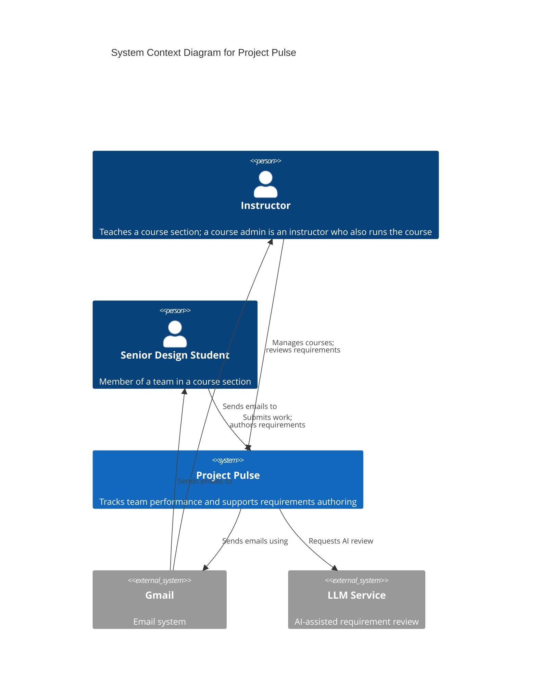
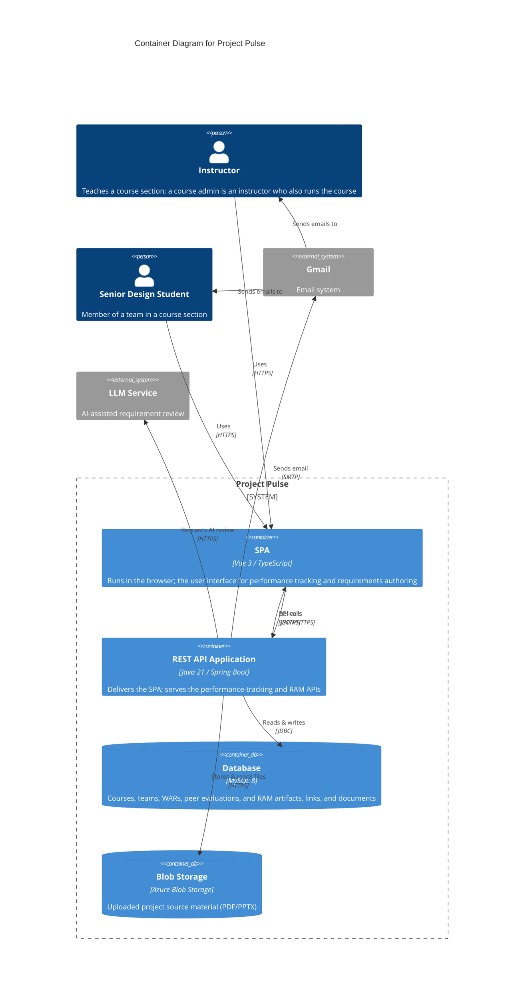
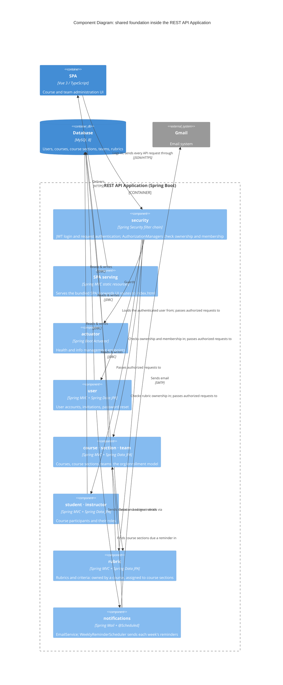
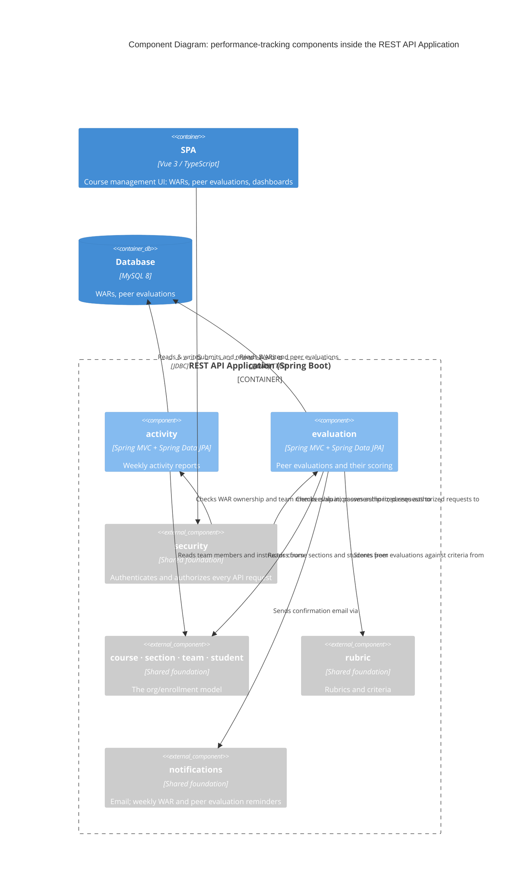
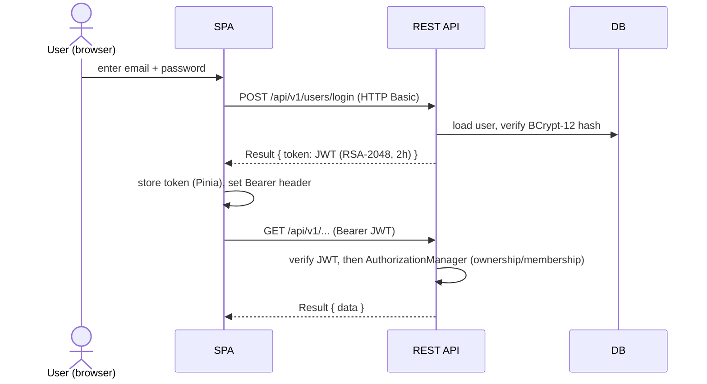
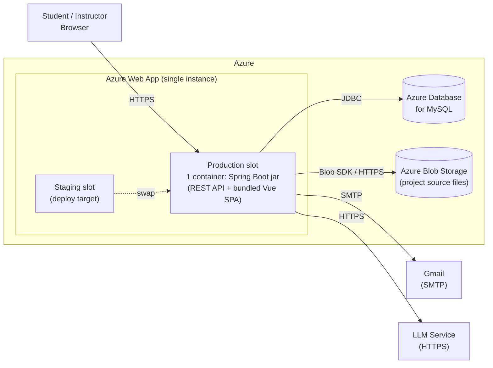

# **Project Pulse**

# **Architectural Design**

> **Architecture-of-record for Project Pulse**, the one application that comprises the shared foundation (courses, course sections, teams), the performance-tracking features (weekly activity reports, peer evaluations) and the RAM module. It holds the whole product's context/container views and conventions, **plus** the RAM module's component view and cross-cutting subsystems (folded into the Building Block View and Crosscutting Concepts below).
>
> Structure: this document follows the **arc42** template (Starke & Hruschka), using **C4** for the context and building-block views. The section names and order are arc42's; numbering is applied at export.
>
> See: [`../README.md`](../README.md) (docs overview), [`../requirements/software-requirements-specification.md`](../requirements/software-requirements-specification.md) (the SRS this design realizes), [`../CLAUDE.md`](../CLAUDE.md) (spec-doc authoring conventions).

## **Introduction and Goals**

Project Pulse was built **before RAM**: the weekly-activity-report, peer-evaluation, and course/course-section/team functionality — together with security, the API conventions, and the deployment pipeline — came first as the working application. **RAM was a separate project, merged in later** to reuse this same course/section/team/security/auth infrastructure. So Project Pulse is the platform, RAM is a module within it, and **the conventions here belong to the platform** — the requirements specs cite them rather than restate them.

This doc is the platform's **architecture-of-record**: the structure, conventions, decisions, cross-cutting concerns, runtime/deployment, and known risks every module inherits or is bounded by. It is **not** named after a use-case area and does not change when one feature is added — it changes when the platform architecture does.

### *Requirements Overview*

The platform's functional requirements live in the **requirements specs** under [`../requirements/`](../requirements/) (a Wiegers/Beatty-style SRS plus use cases, glossary, and business rules), not here. This document realizes those requirements and does not restate them. In brief, the platform delivers weekly activity reporting, peer evaluation, instructor dashboards, and course/section/team management, and — through the RAM module — collaborative requirements authoring (documents, use cases, glossary, traceability, validation, and AI-assisted review).

### *Quality Goals*

> The architecturally significant quality attributes that drive the design, in priority order. The full quality-attribute *requirements* live in the requirements specs; this states the architecture's **response** to the ones that most shape the structure, and [Quality Requirements](#quality-requirements) makes them measurable.

| ID | Quality goal | Why it drives the architecture | How the architecture meets it |
|---|---|---|---|
| QG-security-privacy | **Security & privacy (FERPA)** | The platform holds student educational records (WARs, peer evaluations, scores, requirements). Unauthorized disclosure is the top risk and a regulatory (FERPA) constraint. | JWT auth (RSA keypair); URL-level rules in `SecurityConfiguration` **plus** fine-grained `AuthorizationManager` beans enforcing ownership/membership (a student sees only their team's data; an instructor only their assigned course sections); role hierarchy `admin > instructor > student`; JPA auditing stamps created/modified-by for accountability; `prod` secrets in Azure Key Vault; single-tenant deployment boundary. |
| QG-maintainability | **Maintainability & extensibility** | The codebase is extended continuously — RAM was merged in, senior-design students will extend it, and features are added spec-first via `/design`→`/implement`. New code must stay safe and consistent. | DDD one-bounded-context-per-package vertical slices isolate change; uniform conventions (the `Result` envelope, `Converter<S,T>` DTOs, no Lombok/MapStruct, `/api/v1`) make every slice look alike so a contributor pattern-matches; cross-cutting machinery is centralized in `system`/`security`/`user` so features don't reinvent it; Flyway makes schema change auditable. |
| QG-usability | **Usability / low friction** | Non-expert students must submit WARs and peer evaluations and author requirements quickly — friction directly reduces the frequent participation the platform exists to encourage. | SPA (Vue) for a responsive single-page UX; the uniform `Result` envelope + shared Axios instance give consistent client-side error handling and transparent auth/`401` redirect; RAM autosave + section-level locking prevent lost work and edit collisions; `WeeklyReminderScheduler` emails nudge timely submission. |
| QG-low-ops-burden | **Reliability & low operational burden** | One person deploys and runs Project Pulse with no dev/ops team (`CO-no-ops-team`); the system must deploy and run simply and behave predictably. | One deployable unit (SPA bundled into the Spring Boot jar → one container → one Azure Web App) with nothing to orchestrate; staging slot for safe deploys; Flyway migrations applied at deploy for predictable schema; profile-scoped clocks for testable time; Testcontainers integration tests + `maven-build` PR checks guard regressions; Prometheus/Grafana/Zipkin for monitoring (local dev today; production telemetry is a gap — [TD-prod-observability](#risks-and-technical-debt)). **Accepted trade-off:** the single-instance simplicity (and the per-startup RSA key) caps horizontal scaling — deliberately traded for low ops at the current scale. |

These four strategic goals are refined into the prioritized, individually-cited **architecturally significant requirements** that drive each key decision — see [Architecturally significant requirements](#architecturally-significant-requirements-the-decision-drivers) under Architecture Decisions.

### *Stakeholders*

| Stakeholder | Concern |
|---|---|
| **Students** | Submit WARs and peer evaluations, author requirements; expect low-friction workflows, fair evaluation, and privacy of their records. |
| **Instructors / course admins** | Monitor team progress, review submissions and requirements, manage courses/sections/teams; the primary operators. |
| **Department / institution** | FERPA compliance and stewardship of student educational records. |
| **Developers & maintainers** (incl. senior-design students who extend the codebase) | Clear conventions and maintainability so features can be added safely. |
| **Educator / researcher** (the author) | Use the platform and its docs as a teaching exemplar and research artifact. |

## **Architecture Constraints**

The constraints the architecture must honor. Each is owned by the requirements (or, for the development process, by the methodology); this table cites the owner and records only what the constraint forces on the architecture. The libraries and versions built on top of the mandated stack are choices, not constraints, and are listed under [Technology choices](#technology-choices).

| Constraint | Owner | What it forces here |
|---|---|---|
| FERPA governs student records | `CO-ferpa` | The two-layer ownership/membership authorization ([Security & Compliance](#security--compliance)); the retention gap [TD-ferpa-retention](#risks-and-technical-debt); QG-security-privacy |
| No dedicated ops team | `CO-no-ops-team` | KD-modular-monolith (one deployable), KD-relational-graph (one datastore); QG-low-ops-burden |
| One institution per deployment | `CO-single-tenant` | No tenant isolation: one deployment holds one institution's data ([Security & Compliance](#security--compliance)) |
| One application; RAM is a module | `CO-single-application`, `INT-single-application` | KD-ram-module: RAM reuses the shared foundation's course/section/team, auth and email infrastructure and its conventions, which predate RAM and bind it |
| One authentication mechanism | `CO-single-auth` | KD-self-issued-jwt |
| Vue client, Spring Boot backend | `CO-vue-spring-stack`, `OE-server-stack` | The container technologies; versions and libraries in [Technology choices](#technology-choices) |
| Relational persistence | `CO-relational-persistence` | KD-relational-graph: the requirements graph stored relationally |
| Source material in object storage | `CO-blob-source-material` | Blob Storage alongside MySQL ([Data architecture](#data-architecture)) |
| LLM calls go through the server | `CO-server-side-llm-proxy` | The AI proxy in the REST API container; QS-llm-outage |
| Email through Gmail SMTP | `CO-gmail-smtp` | The SMTP relation to Gmail in the Context and Container views |
| Spec-first development | [`methodology.md`](../methodology.md) | The `/design` → `/implement` workflow; this document's cite-don't-restate relationship to the SRS |

## **Context and Scope**



The Level 1: Context Diagram for the Project Pulse system provides a high-level overview of its interactions with users and external systems. Project Pulse is the central platform for senior-design course delivery: instructors create courses, author Weekly Activity Report (WAR) and peer evaluation templates, and review submissions, while students submit WARs, complete peer evaluations, and view scores and feedback. The Requirements Authoring & Management (RAM) module runs inside this same platform, where students and instructors author, link, and validate requirements as a connected graph of atomic artifacts. Project Pulse integrates with two external systems: the Gmail system, which delivers automated email notifications (reminders, updates) to students and instructors, and an external LLM service (e.g., OpenAI), which the RAM module calls for AI-assisted requirement review. A course admin is not drawn separately because the role is an instructor with course-level rights, not a distinct kind of user. This diagram highlights the instructor and student as primary users, the central functionality of Project Pulse including the RAM module, and the platform's reliance on Gmail for communication and the LLM service for AI assistance, offering a clear picture of the system's operational scope and interactions.

## **Solution Strategy**

The platform's strategy in a few load-bearing moves — each elaborated in [Architecture Decisions](#architecture-decisions) and serving the Quality Goals:

- **One deployable, modular monolith** (KD-modular-monolith) — the SPA bundled into the Spring Boot jar, one container — for low operational burden (QG-low-ops-burden).
- **DDD vertical slices** (KD-vertical-slices) **+ uniform conventions** (the `Result` envelope, `Converter` DTOs, no Lombok — KD-no-codegen) — for maintainability and a low learning curve (QG-maintainability).
- **RAM as a module on the shared platform** (KD-ram-module) — reuse identity, RBAC, the org model, and email rather than build a second system.
- **One relational store** for both modules (KD-relational-graph) — a single backup/migration/compliance surface.
- **Stateless, self-issued JWT** (KD-self-issued-jwt) **+ fine-grained `AuthorizationManager`s** — least-privilege access to regulated data (QG-security-privacy).

### *Technology choices*

The stack built on the mandated Vue/Spring Boot/relational base ([Architecture Constraints](#architecture-constraints)). These are choices, revisable without a requirements change:

- **Backend:** Java 21, Spring Boot 4.0, Maven; Spring Security, Spring Data JPA, Flyway.
- **Frontend:** Vue 3, Vite and TypeScript; Element Plus, SCSS, Pinia, Chart.js (vue-chartjs), TipTap (rich text, used by RAM); Cypress for E2E tests.
- **Data and infrastructure:** MySQL 8; Azure Web App and Azure Blob Storage in production. Local development runs MySQL, Mailpit, Prometheus, Grafana and Zipkin through Docker Compose.

## **Building Block View**

The platform's building blocks at two levels: the **containers**, and the **components** inside the REST API container — the **shared foundation** every feature area builds on, plus the two feature areas on top of it, **performance tracking** and **RAM**.

### *Containers*



The Level 2: Container Diagram for the Project Pulse system provides a detailed view of its internal architecture, illustrating how its containers (the separately running applications and data stores) interact. The system is composed of four containers (the **SPA (Single Page Application)**, the **REST API Application**, the **Database**, and **Azure Blob Storage**), supported by integration with the **Gmail System** for email communication and an external **LLM Service** (e.g., OpenAI) for AI-assisted requirement review. The **SPA**, built with Vue 3 and TypeScript, is delivered to users' browsers and provides the interface for both the course-management workflows (submitting WARs and peer evaluations) and the RAM module's requirements authoring views: graph navigation, document editing, the ReqLint validation sidebar, and the AI assistant panel. The **REST API Application**, implemented using Java 21 and Spring Boot, delivers the SPA, processes REST API calls, and manages interactions with the **Database**. The SPA and the REST API are drawn as two containers even though both ship in one jar (KD-modular-monolith): a C4 container is a separately running unit, and the SPA runs in the browser while the API runs on the server. For the RAM module, the REST API exposes endpoints for the requirements graph, ReqLint validation, and an AI proxy to the LLM service. The **Database**, a MySQL 8 relational database, stores course-management data (WARs and peer evaluation submissions) alongside the RAM module's requirement artifacts, links, documents, and document sections, with CRUD operations executed through the REST API. **Azure Blob Storage** holds one kind of data the relational database deliberately does not: the large binary files of uploaded **project source material** (PDF/PowerPoint); the database keeps only a reference to each blob plus the server-side-extracted text (see the Data architecture section). The REST API integrates with the **Gmail System** over SMTP to send automated notifications and with the external **LLM Service** to support AI-assisted review.

### *Shared foundation components*

This view zooms into the **REST API Application** to show the **shared foundation**: the org/enrollment model, rubrics, identity and security, and notifications, which every feature area builds on. Each component maps to one or more packages under `backend/src/main/java/team/projectpulse/`. The two feature areas, [performance tracking](#performance-tracking-components) and [RAM](#ram-components), add their own components on top of this base.



The REST API has four entry points, and the diagram draws all of them because together they are its attack surface: API requests from the SPA, the static files that deliver the SPA itself, the actuator management endpoints, and the reminder schedule, which fires with no request at all. Every HTTP entry point except static SPA serving passes through the `security` filter chain before reaching a component. The org/enrollment model (`course` · `section` · `team` · `student` · `instructor`) is the data backbone that performance tracking and RAM both reuse (RAM scopes its requirements content to a `team`). `rubric` belongs to the foundation, not to performance tracking, because a `Course` owns its rubrics and criteria (it is the aggregate root; see [Data architecture](#data-architecture)) and each course section is assigned one. `security`'s `AuthorizationManager`s answer ownership and membership questions by looking up courses, course sections, teams, and rubrics; three of them also reach into the `activity` and `evaluation` feature packages, which `MNT-feature-locality` forbids ([TD-feature-locality](#risks-and-technical-debt)). `notifications` is the one component triggered by the clock instead of a request. Most arrows between components are direct repository reads (for example, `section` reads students and instructors through their repositories), so the components share tables rather than each owning its own. The shared conventions (the `Result` envelope, `ExceptionHandlerAdvice`, JPA auditing, profile-scoped clocks) are not components; they are described under [Crosscutting Concepts](#crosscutting-concepts). `dev`-profile seed data (`DataInitializer`) lives in its own `seed` package outside the foundation: it must know every feature to seed it, so it is the one package the dependency rule exempts, and it is not drawn.

### *Performance-tracking components*

This view zooms into the **REST API Application** to show the **performance-tracking** feature area (weekly activity reports and peer evaluations) on top of the [shared foundation](#shared-foundation-components), whose components appear here in grey. Each maps to a package under `backend/src/main/java/team/projectpulse/`.



Every arrow here points into the foundation, which `MNT-feature-locality` allows, and several are direct repository reads (for example, `evaluation` loads rubric criteria through `rubric`'s repository). The one remaining violation in this area runs the other way: three `security` managers import the `activity` and `evaluation` security services ([TD-feature-locality](#risks-and-technical-debt)).

On the **SPA** side the layering is uniform across the app: feature pages call a per-domain API client (`frontend/src/apis/<feature>/`) over a shared Axios instance that attaches the JWT Bearer token, unwraps the `Result` envelope, and redirects to login on `401`. Pinia stores (`token`, `userInfo`, …) hold cross-cutting state; the router enforces `requiresAuth` / role guards.

### *RAM components*

This view zooms into the **REST API Application** to show the **RAM module's** internal structure: one component per DDD bounded context, sitting on the same [shared foundation](#shared-foundation-components) the performance-tracking components also build on. Each maps to a package under `backend/src/main/java/team/projectpulse/ram/`. A Level-2 area design doc designs the inside of one of these boxes; this diagram fixes the boxes and how they relate.

```mermaid
C4Component
    title Component Diagram: RAM components inside the REST API Application

    Container(spa, "SPA", "Vue 3 / TypeScript", "RAM authoring views; calls each component's REST API over JSON/HTTPS")

    Container_Boundary(api, "REST API Application (Spring Boot)") {
        Component(req, "requirement", "Spring MVC + Spring Data JPA", "Requirement artifacts, artifact links and tracing, key-prefix sequences: the requirements graph")
        Component(doc, "document", "Spring MVC + Spring Data JPA", "Requirement documents and document sections, templates and provisioning, section locking, autosave")
        Component(uc, "usecase", "Spring MVC + Spring Data JPA", "Use cases: main steps, extensions, locking")
        Component(glo, "glossary", "Spring MVC", "Glossary terms and terminology invariants")
        Component(val, "validation", "Spring MVC", "ReqLint structural and consistency checks")
        Component(col, "collaboration", "Spring MVC + Spring Data JPA", "Comment threads; real-time presence and broadcast are a deferred layer")
        Component(rev, "review", "Spring MVC + Spring Data JPA", "Review and submission workflow")
        Component(exp, "export", "Spring MVC", "Renders documents to PDF, DOCX, and Markdown")
        Component(src, "sourcematerial", "Spring MVC + Spring Data JPA", "Project source material: upload, storage, server-side text extraction")
        Component(ai, "ai", "Spring MVC + Spring Data JPA", "AI configuration, AI assistants, LLM proxy")
        Component_Ext(security, "security", "Shared foundation", "Authenticates every API request")
        Component_Ext(org, "team · user", "Shared foundation", "Teams that own RAM content; users as authors")
    }

    ContainerDb(db, "Database", "MySQL 8", "RAM artifacts, links, documents, document sections, comments, AI configuration")
    ContainerDb(blob, "Blob Storage", "Azure Blob Storage", "Uploaded project source material")
    System_Ext(llm, "LLM Service", "AI-assisted requirement review")

    Rel(spa, security, "Sends every RAM request through", "JSON/HTTPS")
    Rel(security, req, "Passes authenticated requests to (and to every other RAM component)")
    BiRel(doc, req, "Places artifacts in document sections")
    Rel(uc, req, "Is a requirement artifact in")
    Rel(glo, req, "Derives glossary terms from")
    Rel(col, doc, "Anchors comment threads to")
    Rel(col, req, "Anchors comment threads to")
    Rel(val, req, "Checks artifacts and links in")
    Rel(val, glo, "Checks terminology against")
    Rel(rev, doc, "Locks and submits")
    Rel(exp, doc, "Renders")
    Rel(ai, doc, "Reads context from; proposes edits to")
    Rel(ai, src, "Reads extracted text from")
    Rel(doc, org, "Scopes documents to a team in")
    Rel(req, db, "Reads & writes", "JDBC")
    Rel(doc, db, "Reads & writes", "JDBC")
    Rel(uc, db, "Reads & writes", "JDBC")
    Rel(col, db, "Reads & writes", "JDBC")
    Rel(rev, db, "Reads & writes", "JDBC")
    Rel(src, db, "Stores references and extracted text", "JDBC")
    Rel(ai, db, "Reads & writes", "JDBC")
    Rel(src, blob, "Stores & reads files", "HTTPS")
    Rel(ai, llm, "Proxies AI requests", "HTTPS")
```



These are the RAM module's bounded contexts. Each maps to a package under `ram/` and is the subject of a Level-2 area design doc that designs the inside of one box. The boundaries for areas not yet designed are **provisional**: they are drawn here from the use-case areas so the map is complete, but the first `/design` of an area validates a boundary against the code and **may revise this diagram** (splitting, merging, or re-homing a component, or moving a subsystem owner), recording the change as part of that run.

`requirement` is the hub: the requirements graph lives there, and most other components are views over it or checks against it. `glossary`, `validation`, and `export` own no tables; they read through the components they point at. Every RAM request passes through the `security` filter chain, but RAM defines no `AuthorizationManager`s: each service scopes its lookups to the caller's team itself. Only one `security` arrow and one team-scoping arrow are drawn, to keep the view legible. Unlike the other two views, where direct repository reads point into the foundation and are allowed, several RAM arrows are repository reads between siblings, which `MNT-feature-locality` forbids: `glossary`, `usecase`, and `collaboration` all read `RequirementArtifactRepository` (OI-58, OI-59). The diagram also shows the intended dependency direction where one is decided, not every edge in today's code: `document` and `requirement` still point back at `collaboration` through inverse comment-thread collections (OI-60), so those two pairs are cycles in the code although they are drawn one-way. `document` ↔ `requirement` is drawn two-way because its direction is still open (OI-61). All of these are tracked in [TD-feature-locality](#risks-and-technical-debt). Two components reach outside the relational database. `sourcematerial` stores the large project source material files in the platform's own **Azure Blob Storage** and keeps only a reference plus the extracted text in MySQL (see [Data architecture](#data-architecture)). `ai` is the only component that reaches a third-party service: it proxies to the external LLM service, reading the extracted source material as context.

On the **SPA** side the layering mirrors the rest of Project Pulse: RAM pages (`frontend/src/pages/ram/`) call a per-domain API client (`frontend/src/apis/ram/`) over the shared Axios instance that attaches the Bearer token and unwraps the `Result` envelope; that layering is a platform convention (see [Crosscutting Concepts](#crosscutting-concepts)), not redrawn per area. The build status of each component and subsystem is not tracked here; that is [`../traceability.md`](../traceability.md)'s job, per use case.

## **Runtime View**

> Key runtime scenarios — how the building blocks interact at run time. The physical topology is in [Deployment View](#deployment-view).

### *Authentication and an authorized request*



### *WAR submission (representative course-management flow)*

1. Visit the Project Pulse Website: The Senior Design student begins by accessing the Project Pulse system through their browser at the URL https://projectpulse.team.
2. Deliver the SPA to the student's Browser: The REST API Application (built using Java 21 and Spring Boot) serves the Single Page Application (SPA, built with Vue 3 and TypeScript) to the student's browser. This provides the user interface that students interact with.
3. Submit WARs and Peer Evaluations: The student uses the SPA to complete and submit Weekly Activity Reports (WARs) and peer evaluations through the interface.
4. Make REST API Calls to the Backend: The SPA communicates with the REST API Application by making REST API calls to process and handle the submissions from the student. These calls allow the backend to manage the application's logic and facilitate data processing.
5. CRUD Operations with the Database: The REST API Application performs CRUD (Create, Read, Update, Delete) operations on the Database, which is a relational database. The database securely stores the submitted WARs and peer evaluations.
6. Send Emails via SMTP: The REST API Application interacts with the Gmail system using SMTP to send automated email notifications (e.g., reminders, submission confirmations) to the student or instructor, as necessary.
7. Receive Emails: Finally, the student (or instructor) receives email notifications generated by the Gmail system, completing the interaction loop.

RAM-specific flows (graph navigation, document editing, ReqLint validation, and AI-assisted review) follow the same SPA → REST API → Database path, with the REST API additionally proxying requests to the external LLM service; the LLM round-trip degrades gracefully when the service is unavailable (QS-llm-outage).

## **Deployment View**

> The physical runtime topology, the build/release pipeline, and the scaling posture. The logical structure is in the views above; this is where the system actually runs, and why it is currently single-instance.



### *Topology*

- One **Azure Web App** runs a **single container** — the Spring Boot jar serving both the REST API and the bundled Vue SPA (KD-modular-monolith). It talks to one **Azure Database for MySQL** over JDBC, **Azure Blob Storage** (uploaded project source material) over HTTPS, **Gmail** over SMTP, and the external **LLM** over HTTPS. Releases deploy to a **staging slot** and swap into production (pipeline below).

### *Build & release pipeline*

The whole platform deploys as one unit, RAM included. The CI pipeline (`azure-webapps-deploy.yml`, on push to `main`) builds the Vue frontend, copies the `dist` into `backend/src/main/resources/static/`, builds the Spring Boot jar, packages a Docker image, pushes it to GHCR, and deploys to an Azure Web App staging slot. PR checks (`maven-build.yml`) run `mvn package` (backend build + tests) on PRs to `main`. In production the single Spring Boot container serves both the REST API and the SPA. Schema changes ship as versioned Flyway migrations applied at deploy time.

### *Statefulness*

- The app is largely **stateless**: JWT auth with no server session (`STATELESS`), authoring locks persisted in the DB (not memory), and no application cache. The only per-instance in-memory state is the **RSA signing keypair** (generated at startup, KD-self-issued-jwt).

### *Scaling model & path to multi-instance*

- Today the platform scales **vertically only** — one instance (QG-low-ops-burden; the accepted Scalability trade-off). It is close to horizontally scalable, but three things block it today:
  1. **Per-startup RSA key (KD-self-issued-jwt):** each instance signs with its own key, so instances can't verify each other's tokens. *Fix:* externalize/persist the keypair (or a shared JWKS).
  2. **Scheduled jobs duplicate:** `WeeklyReminderScheduler` (`@Scheduled` cron) fires on every instance, so N instances send N reminder emails. *Fix:* single-execution coordination (ShedLock / leader election / a dedicated scheduler instance).
  3. **Otherwise stateless:** beyond (1)–(2) there is no sticky-session or in-memory-cache barrier — DB-backed locks and stateless auth already support multiple instances.
- Until those are addressed, run a single instance (tracked in Risks and Technical Debt).

### *Availability*

- Single instance ⇒ a single point of failure, with brief downtime on restart/deploy (mitigated by the staging-slot swap). External-dependency failures degrade gracefully (LLM down ⇒ authoring continues, QS-llm-outage; email is best-effort).

## **Crosscutting Concepts**

Conventions, shared machinery, and platform-wide concerns that cut across all building blocks.

### *Architectural conventions*

These are the **canonical** platform conventions, and this Crosscutting Concepts section is their one normative home. The charter files ([root](../../CLAUDE.md), [`backend/`](../../backend/CLAUDE.md), [`frontend/`](../../frontend/CLAUDE.md), and the spec-doc [`CLAUDE.md`](../CLAUDE.md)) restate each rule only as a short working reminder and link back here; when a rule changes, change it here first, then its reminder. Every module follows them.

- **API shape** — all endpoints under `/api/v1` (`api.endpoint.base-url`); every controller method returns the `Result` envelope (`flag`, `code`, `message`, `data`) — never a raw entity; errors are translated centrally by a global `@RestControllerAdvice` (`ExceptionHandlerAdvice`) into the same envelope with `StatusCode` constants. A service signals a missing entity by throwing `ObjectNotFoundException(entityName, id)`, which the advice maps to `404` / `StatusCode.NOT_FOUND`; the one exception is a `*SecurityService`, which returns `false` instead because it runs in the filter chain, beyond the advice's reach (see [Authorization](#authorization)). Request bodies are validated with `@Valid` on the DTO parameter. Search endpoints are `POST <collection>/search` (flat for the foundation, nested under `/teams/{teamId}` for RAM), taking a `Map<String, String>` criteria body plus a Spring `Pageable`.
- **Domain structure** — Domain-Driven Design: one bounded context per package, each owning its full vertical slice (entity → repository → service → controller → DTOs → `Converter<S,T>` → a `*SecurityService` or `*Specs` for dynamic queries). Packages depend on one another only as `MNT-feature-locality` allows: on the shared foundation and on a sibling's service layer, with no cycles, and never the reverse from the foundation (see KD-vertical-slices for which packages form the foundation). **No Lombok** — explicit getters/setters/constructors. **No MapStruct** — bidirectional DTO conversion via Spring `Converter<S,T>` beans. Dependencies are **constructor-injected**, never field-injected with `@Autowired`.
- **Authorization** — JWT-based auth (RSA key pair generated at startup); URL-level rules in `SecurityConfiguration`'s filter chain **plus** fine-grained `AuthorizationManager` beans for ownership/membership checks. Role hierarchy `admin > instructor > student`.
- **Caller identity:** a service reads the current user's id, roles, course, and course section through `UserUtils` (`hasRole`, `getUserId`, `getUserCourseId`, `getUserSectionId`, …), never from `SecurityContextHolder` directly. How a caller's scope is derived therefore lives in one class, which the caller-derived scope of [Authorization](#authorization) point 2 relies on.
- **Time:** there are two kinds of time, and they read different clocks. **Calendar time** (active weeks, report and evaluation deadlines, scheduled reminders, audit timestamps) comes from the injected `Clock` bean via `LocalDateTime.now(clock)`, never `LocalDateTime.now()`. The `dev` profile's clock is **fixed** at 2023-08-20 23:30 in `app.timezone` so the seed data's weeks line up; `staging` and `prod` use the system clock in `app.timezone`. **Elapsed time** (JWT issue and expiry, edit-lock leases under `BR-lock-expiry`) uses the real clock (`Instant.now()`), because a frozen clock would stop it: a token would never age and a lock would never lapse, and Spring Security validates JWT expiry against real time regardless.
- **Persistence & migrations** — relational DB via JPA. Schema is delivered as **Flyway** migrations (`backend/src/main/resources/db/migration/`). The `dev` profile uses `ddl-auto: create` + `DataInitializer` seed data; `staging`/`prod` use Flyway only (`ddl-auto: none`), with migrations applied at deploy time. A schema change ships as a new `V<n>__description.sql` migration. A new domain adds representative rows to `DataInitializer`, because the integration tests run against that seed.
- **SPA serving** — in production the Spring Boot app serves both the API and the built SPA from `static/`; `WebConfig` forwards non-API UI routes (registered for one-, two-, and three-segment paths) to `index.html` for client-side routing.
- **Client ↔ API contract:** every SPA call goes through the one shared Axios instance (`frontend/src/utils/request.ts`) via a per-domain module in `src/apis/<feature>/`, never a bare `axios` or `fetch`. The instance attaches the JWT as a `Bearer` header and unwraps each response to the `Result` envelope. It also handles errors in one place: a `401` clears the token and user stores and redirects to login, a `403` or `404` routes to the forbidden or not-found page, and anything else raises a toast. The token is persisted in `localStorage` (the Pinia `token` store).

### *Cross-cutting subsystems*

Shared machinery every module reuses rather than reimplements — owned by the cross-cutting packages, not any one domain.

| Subsystem | Owner | Notes |
|---|---|---|
| Standard API envelope & error handling | `system` (`Result`, `StatusCode`, `ExceptionHandlerAdvice`) | Every controller returns `Result`; all exceptions funnel through the global advice |
| Authentication & RBAC | `security` (`SecurityConfiguration`, `authorizationmanagers/`) | JWT (RSA keypair at startup); URL rules + ownership/membership managers |
| Shared user model | `user` (`PeerEvaluationUser` base, password reset, invitation) | Common identity base for students/instructors; the auth subject for both modules |
| Authorship & auditing | `system` (JPA auditing, `PeerEvaluationUserAuditorAware`) | Created/modified-by metadata applied automatically across entities |
| Email / notifications | `system` (`EmailService`, `WeeklyReminderScheduler`) | Gmail over SMTP; scheduled reminders |
| Time & profiles | `system` (`DevClockConfig` / `StagingClockConfig` / `ProdClockConfig`) | Profile-scoped clocks for testable time |
| Dev seed data | `seed` (`DataInitializer`) | `dev`-profile fixtures (the dev credentials) |

### *RAM cross-cutting subsystems*

Beyond the platform-wide machinery above, each **RAM** area builds on a small set of RAM-owned **shared subsystems** rather than reinventing them; a Level-2 area design should *plug into* the relevant row, not redesign it. The FR families are specified in the SRS's Non-Use Case Functional Requirements; "owner" is the package that provides the machine. (Per-use-case build status lives in [`../traceability.md`](../traceability.md), not here.)

| Subsystem | FR family | Owner | How an area plugs in |
|---|---|---|---|
| Section locking | `BR-edit-lock-required`, `BR-lock-expiry` | `ram/document` (`DocumentSectionLock`), `ram/usecase` (`UseCaseLock`) | Acquire/release a lock on the authoring destination before edit (UC-DOC-edit-document / UC-DOC-edit-use-case) |
| Document templates | `FR-TPL-*` | `ram/document/template` (`DocumentTemplateRegistry`) | Provision a document's sections from its `DocumentType` template |
| Collaboration | `UC-COL-*` | `ram/collaboration` | Attach comment threads to an artifact / destination (the built collaboration model). Real-time presence/broadcast (UC-COL-collaborative-edit, PER-collab-latency) is **deferred** — a future layer, not in the current design (see KD-section-locking) |
| Glossary | `FR-GLO-*` | `ram/glossary` | Terminology lookups and invariants |
| Authorship & history | `FR-HIS-*` | `system` (JPA auditing, `PeerEvaluationUserAuditorAware`) | Inherited via JPA auditing — no per-area work |
| Notifications | `FR-NOT-*` | `system` (`EmailService`, `WeeklyReminderScheduler`) | Call `EmailService`; Gmail over SMTP |
| Security / RBAC | `FR-SEC-*` | `security` (`AuthorizationManager` beans) | Add a URL rule (with an ownership/membership manager where the answer needs domain knowledge) **and** scope the service's lookup by owning team: both enforcement points |
| Autosave | `FR-SAVE-*` | `ram/document` (section save) + client-side debounce | Persist edits through the document-section save endpoint |
| Validation (ReqLint) | `FR-VAL-*` | `ram/validation` | Deterministic structural checks (UC-VAL-run-validation) |
| AI assistants | `FR-AI-*` | `ram/ai` (LLM proxy) | Proxy to the external LLM service |
| Export | `SI-export-formats`/`SI-export-fidelity` | `ram/export` | Export rendering to PDF/DOCX/Markdown preserving template structure (UC-EXP-export-document, UC-EXP-export-bundle) |
| Project source material | `SI-import-allowlist`/`SI-import-extraction` | `ram/sourcematerial` | Upload (PDF/PPTX, allowlisted, ≤ 25 MB), storage, and server-side text extraction for AI context (UC-AI-import-source-material). Binary storage & extraction: see [Data architecture](#data-architecture) |

### *Security & Compliance*

> Security is the top-priority quality goal (QG-security-privacy): the platform holds student educational records regulated under **FERPA**. This is the consolidated security view — authentication, authorization, data protection, threat boundary — recording both the **controls in place** and the **known gaps** a production deployment must close. Mechanics live in `security/` and `user/`; this explains the design, it doesn't restate every rule.

#### **Trust boundary**

Single-tenant (`CO-single-tenant`): one deployment serves one institution. The trust boundary is the REST API: the SPA runs in the user's browser and is untrusted, so every request is authenticated and authorized server-side. The SPA and API share one origin (the SPA is served from the API jar), so production needs no CORS ([TD-wildcard-cors](#risks-and-technical-debt) notes the wildcard is still configured). TLS terminates at the Azure edge; the app trusts the platform for transport encryption (it does not enforce HTTPS itself).

#### **Authentication**

- **Login:** HTTP Basic (email + password) → server issues a JWT (`AuthController` / `JwtProvider`). Passwords hashed with **BCrypt (strength 12)**.
- **Tokens:** self-issued JWTs, **RSA-2048** signature, **2-hour** expiry, claims `sub`, `userId`, space-delimited `authorities`. Stateless OAuth2 resource server (`SessionCreationPolicy.STATELESS`).
- **Provisioning:** invitation-gated registration (`user/userinvitation` — `validateUserInvitation` rejects any sign-up without a matching course-admin-issued invitation; see Known gaps); password reset via a one-time token valid **5 minutes**.
- **Known gaps:** no token **refresh** or **revocation/blocklist** — a token is valid for its full 2h (a leaked token can't be revoked; logout is client-side only). The RSA key regenerates per startup (KD-self-issued-jwt). **`POST /students` and `POST /instructors` are `permitAll()` at the security-filter level, but registration is gated in the service layer**: both paths call `validateUserInvitation`, which rejects any registration lacking a course-admin-issued, single-use invitation whose email, token, role, course, and section all match (invitations are created via UC-STU-invite-students / UC-INS-invite-instructors). So account creation is **not** open self-registration — a stranger cannot self-provision, and an instructor account requires an *instructor* invitation. The residual concern is defense-in-depth: the only gate is service-layer (there is no filter-chain authorization rule), and the endpoint is unauthenticated and unthrottled (rate limiting is [TD-auth-rate-limit](#risks-and-technical-debt)).

#### **Authorization**

- **Role hierarchy** `admin > instructor > student` (`RoleHierarchyImpl`); method security enabled (`@EnableMethodSecurity`).
- **Deny by default.** The last rule under `${api.endpoint.base-url}` is `.denyAll()`, so an API route that no explicit rule matches is refused for everyone rather than falling through to a bare `.authenticated()` check. A forgotten rule therefore costs a feature, loudly, instead of silently opening that route to every logged-in user, which is how the glossary routes came to be readable across teams (OI-47). The catch-all governs the API base URL only: the SPA entry point, its `WebConfig` forwards, static assets, and `/error` sit outside it and are still matched by the trailing `.anyRequest().permitAll()`. `/actuator/**` also sits outside it and therefore carries rules of its own (see [Observability & operations](#observability--operations)). The public API endpoints (login, the two password-reset paths, the existence check, and the two invitation-gated registration paths) are explicit `permitAll()` rules above the catch-all and are unaffected.
- **Two enforcement points.** Every request that reaches data passes both, and each answers a different question. **Point 1, the route rule** in `SecurityConfiguration` answers *may this caller call this URL at all*: either a plain check (`hasAuthority`, `.authenticated()`) or `.access(…AuthorizationManager)` when the answer needs domain knowledge, in which case the manager is a thin wrapper over a per-domain `*SecurityService` enforcing **ownership** (the user created the resource) or **membership** (the user belongs to the same course/section/team). That manager and security-service pair is how point 1 is *built*, not a second defence. **Point 2, the team-scoped persistence query** in the service answers *is the object this request names actually in the caller's scope*, by loading an object by id **and** owning team together rather than by primary key. The scope belongs in the query itself, not in a comparison made after an unscoped load: the check-after form refuses the request just as correctly, but it leaves the unscoped load in the codebase as the pattern the next contributor copies, and it can be deleted without any test failing. Where the URL carries no container id (the flat foundation routes, and any search endpoint), the service derives the scope from the **caller** instead: a student is bound to her own team (BR-team-scoped-access), an instructor to her course section (BR-section-scoped-access), and a container id in the request body can only filter within that scope, never set it.
- **Why both are required.** A route rule reads `{teamId}` out of the request URI, so it proves only that the caller belongs to *the team named in the URL*. It never proves that the object named beside it belongs to that team, so a caller who passes their **own** `teamId` next to **another team's** object id passes it. The converse fails equally: a scoped query with no route rule is worthless, because the caller then chooses the `teamId` being scoped by. Neither one alone is enough. Each cross-team defect found in the RAM module in September 2026 was one of the two missing: the glossary routes had neither, the document-section GET had the scoped query but no rule, and the artifact and use-case lookups had the rule but no scoping (see OI-46 and OI-47). Ids that arrive in a **request body** pass neither point: a reference to another object must be re-resolved through a scoped finder in the service, and an ownership field (author, owning team) is never read from the body but stamped server-side from the authenticated caller.
- **Guards fail closed, and never throw.** A manager takes its ids from the URI template variables the matched rule itself bound (`RequestAuthorizationContext.getVariables()`), never by re-parsing the request URI, so the guard and the routing cannot drift into disagreeing about which object a request names. (A manager that parsed the path itself did drift: `PATCH /users/{userId}` was bound to one that recognised only `/students/`, `/instructors/` and `/evaluations/evaluators/`, so it denied every request from the day it was written.) Whatever it cannot resolve, an id that names no row, an id that is not a number, a relationship that is genuinely optional and not yet established (a student not yet assigned to a team, a course section with no rubric), is a denial: the `*SecurityService` methods return `false` rather than throwing. Only optional relationships need that check; a mandatory association is declared `@ManyToOne(optional = false)` on the entity, so the object model already forbids the state. Managers run inside the filter chain, ahead of the `DispatcherServlet`, so an exception thrown there misses `ExceptionHandlerAdvice` and escapes into the container's error dispatch as a `500` that also tells the caller which ids exist. A uniform `403` removes that oracle.
- **Effect:** a student reaches only their own team's data, and an instructor only their assigned sections. This is the architectural realization of least privilege (QS-cross-team-denial).
- **Client-side role checks are by convention, not by hierarchy.** The `RoleHierarchyImpl` expansion applies **server-side only**. The JWT's `authorities` claim is the user's *literal* `roles` string, and the SPA router guard (`router/guards.ts` `checkPermissions`) does a **flat membership test** against it — it does **not** expand `admin ⇒ instructor ⇒ student`. Client-side gating therefore relies on the convention that **every account's `roles` string already lists each level it should satisfy** (admins are seeded as `"admin instructor"`). **Invariant to uphold:** any admin account must be provisioned with `roles` that include `instructor` (and `student` where student-only routes must be reachable) — an admin created as `"admin"` alone would be authorized server-side yet **blocked from `instructor` routes in the SPA**, a silent client/server mismatch. The alternative (mirror the hierarchy in the client guard) is tracked as OI-38.

#### **Data protection & FERPA**

- **Records handled:** WARs (student contributions), peer evaluations (sensitive peer judgments), scores/feedback, requirements artifacts, identity (names/emails).
- **Least privilege:** the ownership/membership model above — the primary FERPA control.
- **Accountability:** JPA auditing (`PeerEvaluationUserAuditorAware`) stamps created/modified-by + timestamps.
- **Secrets:** `staging`/`prod` load secrets from **Azure Key Vault**; none in source.
- **Encryption:** in transit via Azure-edge TLS; at rest via Azure-managed database encryption — both platform-provided, not app-configured.
- **Known gaps (FERPA obligations not yet designed):** no **retention / deletion / end-of-course purge** policy and no student data **access/correction** workflow (structural cascade deletes exist but are not a retention policy); no documented audit-log retention or data-minimization review. **Wide-open CORS** (`allowedOrigins("*")`) — low risk given bearer-token (non-cookie) auth and same-origin prod serving, but should be allowlisted to the SPA origin. No **rate limiting** on auth endpoints (brute-force exposure; `/users/exists/{email}` also enables email enumeration).

#### **Threat model (scope)**

- **In scope (addressed):** cross-team / cross-section data access (AuthorizationManagers), credential theft (BCrypt-12, short-lived JWT), unauthorized role escalation (role hierarchy + ownership).
- **Out of scope / accepted at current scale:** DDoS and rate-limiting, multi-tenant isolation (single-tenant by design, `CO-single-tenant`), advanced persistent threats — revisited if scale or deployment model changes.

### *Data architecture*

> The platform's persistence strategy and the decisions behind it — strategy and pointers, not a table-by-table schema (the conceptual model is owned by the requirements specs' domain models; the code owns the physical detail). RAM's requirements-graph persistence is a module-level concern owned by the RAM module (see [RAM components](#ram-components)).

#### **Store & schema**

- One relational store: a single **MySQL 8** schema shared by both modules (KD-ram-module, KD-relational-graph). Foundation and performance-tracking tables (WARs, evaluations, courses/sections/teams, users) and RAM tables (documents, artifacts, links, comments) live side by side — one backup, one migration history, one FERPA surface. The one store kept *outside* MySQL is **uploaded project source material**, whose large binaries live in Azure Blob Storage (see [Binary content & file storage](#binary-content--file-storage)).
- ORM is **JPA/Hibernate**; entities use IDENTITY-generated primary keys (`@GeneratedValue(strategy = IDENTITY)`), no Lombok.

#### **Domain & aggregate model**

- `Course` is the aggregate root, and ownership cascades downward. This is the physical realization of the SRS's [Business Domain Model](../requirements/software-requirements-specification.md#business-domain-model), which owns the entities and their fields:

```
Course (aggregate root)
├── Criterion[]        (CascadeType.ALL)
├── Rubric[]           (CascadeType.ALL; a rubric groups criteria)
└── Section[]          (CascadeType.ALL; each references one of its course's rubrics)
    ├── Team[]         (CascadeType.ALL)
    │   └── Student[]  (no cascade; students belong to the course section and are assigned to a team)
    └── Student[]      (CascadeType.ALL)
```

- `Instructor` sits outside the cascade and is saved separately. It is associated at three levels: `Course` (many-to-many, plus the one `courseAdmin`), `Section` (many-to-many), and `Team` (many-to-one). Each instructor also keeps a `defaultCourse` and `defaultSection` preference.
- A `Student` belongs to exactly one course section (`optional = false`) but its `team` is optional, because teams are assigned after registration.
- `Activity` and `PeerEvaluation` are independent entities, not cascaded from `Course`; they reference `Student` and `Team`.
- `Student` and `Instructor` extend the abstract `@Entity` `PeerEvaluationUser`, mapped with JPA **single-table inheritance** (the default) — one users table, the shared auth subject for both modules.
- RAM entities (documents, document sections, requirement artifacts, artifact links, use cases, glossary, comments) are **scoped to a Team**; their physical mapping (the artifact table, the typed edge/link table, per-team key sequences) is the RAM module's data architecture (see [RAM components](#ram-components)).

#### **Transactions & consistency**

- The **transaction boundary is the service method** — services are `@Service @Transactional`, so a controller call commits or rolls back as a unit.
- **Concurrency:** core entities rely on transactional consistency without row versioning. RAM, which has concurrent multi-author editing, adds **optimistic locking** (`@Version`) on its mutable content aggregates (`RequirementDocument`, `DocumentSection`, `UseCase`, `ArtifactKeySequence`) to prevent lost updates — and above that, the **pessimistic section-level locks** (`DocumentSectionLock`/`UseCaseLock`, whose own rows are likewise `@Version`-guarded) that serialize human editing (KD-section-locking). The `@Version` on `ArtifactKeySequence` keeps per-team key generation (`UC-1`, `FR-1`, …) collision-free under concurrency.

#### **Schema management**

- Schema is versioned as Flyway migrations; the per-profile behavior and the rules for a schema change are normative in [Architectural conventions](#architectural-conventions) (Persistence & migrations).

#### **Binary content & file storage**

- Beyond the relational graph, RAM accepts **uploaded files** — a team's *project source material* (PDF/PPTX, allowlisted file types, ≤ 25 MB per file) imported as input for the AI assistants (SI-import-allowlist, SI-import-extraction, UC-AI-import-source-material). For each accepted upload the module stores **the file's bytes** and the **server-side-extracted text** used as assistant context.
- **Storage location:** the large binary files live in **Azure Blob Storage**; MySQL holds only a **reference** (blob path/URL + metadata) and the **server-side-extracted text**. Large media don't belong in the relational store — keeping bytes out of MySQL keeps the DB small and backups/migrations fast. The cost is a **second managed store**: the FERPA surface now spans MySQL **and** the Blob container (both Azure-managed and encrypted at rest, within the one single-tenant deployment). The `export` component writes and reads file bytes through the Blob SDK over HTTPS and persists the reference + text over JDBC.
- **Text extraction** runs **server-side** (a parsing step, e.g. Apache Tika / PDFBox + Apache POI) and reports incomplete extraction for image-only or scanned files (SI-import-extraction; UC-AI-import-source-material). The browser never parses files; uploads are multipart to the REST API, which streams the bytes to Blob Storage and persists the reference + extracted text in MySQL.

#### **Document export**

- Export (UC-EXP-export-document, UC-EXP-export-bundle, SI-export-formats, SI-export-fidelity) renders a document — or a **bundle** of all of a team's documents — to **PDF, DOCX, or Markdown** from the stored section content, preserving the template-defined structure (table of contents, heading hierarchy, numbering, formatting). Rendering is a **server-side** step in the `export` component; the specific rendering toolchain/library is an open decision settled at `/design` of the EXP area. Export reads existing data only — it adds no persistent state.

#### **Retention**

- No data **retention / deletion / archival** policy is implemented today (structural cascade deletes are not a retention policy) — a known FERPA gap tracked in [Security & Compliance](#security--compliance) and Risks and Technical Debt.

### *Observability & operations*

> How the running platform is monitored — metrics, tracing, health. Telemetry is wired via Spring Boot **Actuator** + **Micrometer**; the collectors and dashboards run in Docker for local development.

#### **Metrics**

- Actuator + Micrometer expose JVM / HTTP / application metrics, intended for **Grafana** via **Prometheus** (both `docker-compose`, local dev only). `/actuator/prometheus` does **not** resolve in this build, although `micrometer-registry-prometheus` is a dependency: Spring Boot 4 moved that endpoint, and `heapdump`, into modules that are not on the classpath. `custom-beans` names no endpoint, and `httpexchanges` also needs an `HttpExchangeRepository` bean that is never defined. All four are in the dev exposure list but resolve to nothing (observed 2026-09-06; the dependencies have not changed since), so the local Prometheus scrape collects nothing.

#### **Tracing**

- Distributed tracing via **Micrometer Tracing (Brave)** + `zipkin-reporter-brave`, exported to **Zipkin**; sampling probability **0.1** (10%).

#### **Health & info**

- **Staging and prod** expose only `health` (with **liveness/readiness probes**; details shown to admins only) and a trimmed `info`, both anonymous; any other endpoint is `ROLE_admin` in `SecurityConfiguration`. **Dev** additionally exposes `metrics`, `env`, `beans`, `configprops`, `loggers` and `mappings`, with values unmasked.

#### **Logging**

- Spring Boot default (Logback) to stdout; no structured or aggregated log store.

#### **Operations**

- One container on one Azure Web App; releases flow through the CI pipeline to a staging slot (see [Deployment View](#deployment-view)), with Flyway migrations applied at deploy.

#### **Known gaps / operational risks**

- **Actuator exposure incident, 2026-09-06 (closed; [TD-actuator-exposure](#risks-and-technical-debt)).** The actuator paths fell outside the `/api/v1` rules and reached `anyRequest().permitAll()`, and the dev exposure list with unmasked values applied to every profile, so `/actuator/env` disclosed credentials to anonymous callers on both slots. The code fix, credential rotation and verification are recorded in TD-actuator-exposure; the residual network exposure is [TD-db-public-access](#risks-and-technical-debt). The architectural lesson is recorded under Authorization: deny-by-default covers only the API base URL, so any path outside it, such as `/actuator/**`, needs rules of its own.
- **A `200` is not proof an actuator endpoint exists.** Production serves `index.html` with `200 text/html` for unknown paths, so only the content type (`application/vnd.spring-boot.actuator.v3+json`) distinguishes a real endpoint from the SPA fallback. Check that, not the status, when probing a deployment.
- **No production observability backend** — Prometheus/Grafana/Zipkin run only in local dev (`docker-compose`); production telemetry is **not collected** anywhere yet. A prod path (e.g. Azure Monitor / Application Insights / Managed Grafana scraping Actuator) is an open item.
- No **alerting** rules or **SLOs**, and no centralized log aggregation.

## **Architecture Decisions**

> The architecturally significant decisions and their rationale (context → decision → consequences, including the alternative rejected). Status is *Accepted* unless noted. Each decision names the **architecturally significant requirement(s)** that drive it — the utility-tree table below.

### *Architecturally significant requirements (the decision drivers)*

Not every requirement shapes the architecture. The **architecturally significant requirements (ASRs)** are the few that do: the prioritized quality attributes plus the hard constraints whose cost of getting wrong is *system-wide*. They are the drivers the decisions below answer — the [Quality Goals](#quality-goals) are their strategic roll-up, and each ASR carries a name-based `ASR-<slug>` handle while **citing the existing SRS handles** it rolls up (it restates no requirement). Listed in rank order of architectural significance (importance × difficulty — a utility tree), the significant few are:

| ID | ASR (driver) | SRS handle(s) | Significance | Drives |
|---|---|---|---|---|
| ASR-student-record-confidentiality | Confidentiality of FERPA-regulated student records | `SEC-authorization`, `SEC-ferpa`, `CO-ferpa` | High × High | KD-ram-module, KD-self-issued-jwt; the two-layer ownership/membership authorization |
| ASR-low-ops-burden | Low operational burden: one operator, no ops team | `AVL-uptime`, `CO-no-ops-team` | High × Medium | KD-modular-monolith, KD-relational-graph |
| ASR-maintainability-learnability | Maintainability & learnability — student contributors extend the code | `MNT-feature-locality`, `MNT-service-layer`, `INT-single-application`; QG-maintainability (learnability is a pedagogical driver) | High × Medium | KD-ram-module, KD-no-codegen, KD-vertical-slices |
| ASR-no-lost-work | No lost authored work under concurrent editing | `ROB-no-overwrite`, `ROB-edit-loss-bound`, `PER-autosave-cadence` | High × Medium | KD-section-locking + autosave |
| ASR-self-hosted-auth | Single self-hosted authentication, no external IdP | `CO-single-auth`, `SEC-authentication` | Medium × Medium | KD-self-issued-jwt |
| ASR-cohort-scale-performance | Responsive graph & validation at cohort scale | `PER-graph-load`, `PER-validation-speed`, `SCA-cohort-load` | Medium × Medium | KD-relational-graph; the accepted SQL-traversal trade-off |
| ASR-llm-degradation | Graceful degradation when the LLM is unavailable | `AVL-llm-degradation`, `SI-llm-degradation`, `PER-ai-response-time` | Medium × Low | the AI-proxy isolation; QS-llm-outage |

The functional structure (the [component views](#building-block-view) above) is the *other* input to the architecture, decomposed from the use-case areas. This table is the bridge from requirements to architecture: **functionality can be satisfied by many structures, so the quality attributes and constraints are what pick among them** — and the reversible, local choices are deferred to per-area design rather than committed here.

**KD-modular-monolith — Single deployable (modular monolith).** *Accepted.*
- **Driving ASR(s):** ASR-low-ops-burden (`AVL-uptime`, `CO-no-ops-team`), bounded by ASR-cohort-scale-performance (`SCA-cohort-load`).
- **Context:** Instructor-scale deployment, no dedicated ops team; delivery speed and operational simplicity matter more than scaling parts independently.
- **Decision:** Build the Vue SPA into the Spring Boot jar (served from `static/`), ship one Docker image to one Azure Web App — API + SPA in one process.
- **Consequences:** Simplest possible deploy/run (QG-low-ops-burden); one artifact, one pipeline. *Rejected* microservices / separate SPA hosting — network + ops complexity unjustified at this scale. *Trade-off:* the app scales only as a whole.

**KD-ram-module — RAM as a module inside the platform.** *Accepted.*
- **Driving ASR(s):** ASR-maintainability-learnability, for reuse (`MNT-service-layer`, `INT-single-application`, `CO-single-application`), and ASR-student-record-confidentiality, for reuse of the existing authorization surface (`SEC-authorization`).
- **Context:** RAM began as a separate project but needs the same course/section/team/student/auth/email infrastructure Project Pulse already had.
- **Decision:** Merge RAM in as `ram/*` bounded contexts on the shared base, not a separate system.
- **Consequences:** Reuses identity, RBAC, org model, email; one deployment; uniform conventions. *Rejected* a standalone RAM service — would duplicate the org/auth model and add cross-service integration. *Trade-off:* RAM's lifecycle is coupled to the platform's.

**KD-relational-graph — Relational DB for the requirements graph.** *Accepted.*
- **Driving ASR(s):** ASR-low-ops-burden, through one store (`CO-relational-persistence`, `DI-persist-graph`), and ASR-cohort-scale-performance, for acceptable graph performance at cohort scale (`PER-graph-load`, `SCA-cohort-load`).
- **Context:** RAM's data is a graph (artifacts + typed links + traceability), which hints at a graph DB — but the platform already runs MySQL with relational tooling/ops.
- **Decision:** Store the graph relationally (artifacts as rows, links as an edge table) in the existing DB.
- **Consequences:** The requirements graph is one relational datastore — one backup/migration/FERPA surface — and reuses JPA + conventions. *Rejected* Neo4j/graph DB — a second datastore and new ops, unjustified at typical per-team graph size. *Trade-off:* deep traversals are SQL joins / recursive queries, not native graph ops. (The graph is wholly relational; the lone exception to the single-store picture is uploaded project source material, whose large binaries live in Azure Blob Storage — see [Data architecture](#data-architecture).)

**KD-self-issued-jwt — Self-issued, stateless JWT (RSA keypair generated at startup).** *Accepted; key handling incidental — revisit.*
- **Driving ASR(s):** ASR-self-hosted-auth (`CO-single-auth`, `SEC-authentication`) and ASR-student-record-confidentiality (`SEC-authorization`, `SEC-ferpa`).
- **Context:** Wanted stateless auth (no server-side session store); no external identity provider in scope.
- **Decision:** Self-issue and verify JWTs rather than use sessions or an external IdP. The current implementation generates the RSA keypair at application startup.
- **Consequences:** No session store; simple. *Rejected* external IdP / institutional SSO — beyond integration cost, institutional SSO onboarding is impractical at this scale (the institution's IT will not provision a relying-party integration for a course tool), so the platform authenticates users itself; the SRS's auth requirements (FR-SEC-authentication, CO-single-auth) accordingly delegate to *this* mechanism, not to an external IdP. *Rejected* sessions (server state). **Known limitation (incidental, not by design):** because the keypair is generated per startup and not persisted, every restart/redeploy invalidates all live tokens (users re-login) and a second instance can't verify the first's tokens — effectively capping the app at one instance. Externalizing/persisting the keys would lift this. (Drives the Scalability "accepted" trade-off and QS-release-deploy; revisit when multi-instance is needed.)

**KD-no-codegen — No Lombok / no MapStruct (pedagogical).** *Accepted.*
- **Driving ASR(s):** ASR-maintainability-learnability, for student contributors (`MNT-service-layer`; learnability is a pedagogical driver — QG-maintainability — not a formal SRS attribute).
- **Context:** The codebase is read and extended by students learning Spring/Java; annotation-processor "magic" can obscure what the code actually does.
- **Decision:** Explicit getters/setters/constructors and explicit `Converter<S,T>` beans — no Lombok, no MapStruct.
- **Consequences:** Fully explicit, debuggable code with no build-time codegen, so students see exactly what runs — a deliberate teaching choice. *Rejected* Lombok/MapStruct — less boilerplate but hidden behavior and extra tooling to learn. *Trade-off:* more verbose, hand-written conversion code.

**KD-section-locking — Pessimistic section-level locking for collaborative editing.** *Accepted.*
- **Driving ASR(s):** ASR-no-lost-work (`ROB-no-overwrite`, `ROB-edit-loss-bound`), with `PER-collab-latency` the deferred real-time trade-off.
- **Context:** Teammates edit the same requirement document concurrently; lost updates on authored content are unacceptable, and a predictable model beats complex merge.
- **Decision:** Lock at document-section (and use-case) granularity — one editor holds a section; others are blocked.
- **Consequences:** No lost updates, simple mental model, fine-grained enough for parallel work on different sections. *Rejected* optimistic concurrency / OT / CRDT real-time co-editing — far more complex; real-time presence/broadcast (UC-COL-collaborative-edit) is **deferred** (not in the current release) and would be a *future layer on top*, not a replacement — until then there is no real-time push channel in the topology, and the related targets (PER-collab-latency presence-propagation, ROB-no-overwrite) are out of scope. *Trade-off:* two people can't edit the same section at once.

**KD-vertical-slices — DDD bounded-context vertical slices, layered within.** *Accepted.*
- **Driving ASR(s):** ASR-maintainability-learnability (`MNT-feature-locality`, `MNT-service-layer`, `INT-single-application`; QG-maintainability). Verified by QS-add-bounded-context.
- **Context:** The codebase is extended continuously by rotating student contributors; the common change is "add or modify one feature," and it must not ripple across unrelated features.
- **Decision:** Partition the backend by **domain** — one bounded context per package, each a full vertical slice (entity → repository → service → controller → DTO/`Converter`) — and layer *within* each slice, rather than partitioning by technical layer. A slice may use a sibling slice only through that sibling's service layer, never its repositories; slices form no dependency cycles; and the shared foundation (`system`, `security`, `user`, `rubric`, and the org model: `course`, `section`, `team`, `student`, `instructor`) depends on no feature slice (`MNT-feature-locality`). The `dev` seed package (`seed`) is the one exemption. The code does not yet meet this rule; see TD-feature-locality.
- **Consequences:** A feature change stays inside one slice; a new bounded context is added without touching existing ones (QS-add-bounded-context: zero changes to other packages, delivered in ≤ 2 person-days); the uniform slice shape lets a contributor pattern-match across the codebase. *Rejected* package-by-layer (all controllers together, all services together) — it optimizes for the rare "swap a technical layer" change over the common "change one feature" change, and scatters a single feature across the package tree. *Trade-off:* cross-cutting concerns (auth, auditing, email) must be deliberately centralized in `system`/`security`/`user` so they aren't duplicated per slice.

## **Quality Requirements**

> Refines the [Quality Goals](#quality-goals) into a prioritized quality tree and concrete, measurable scenarios. Each scenario is ATAM-style (source · stimulus · environment → response → **measure**); the measures are the testable targets the architecture must hold.

### *Quality tree*

- **Security** *(High)* — confidentiality of student records; authorization correctness; auditability → QS-cross-team-denial, QS-unauthenticated-rejection
- **Maintainability** *(High)* — modifiability (add a bounded context), convention consistency, testability → QS-add-bounded-context
- **Usability** *(High)* — low-friction submission, error clarity, no lost work → QS-autosave-mid-edit. **Accessibility** (WCAG 2.1 AA — keyboard operability, contrast, screen-reader support; required by the SRS's USE-wcag-aa/UI-wcag-aa, addressing risk RI-accessibility) is **in scope but not yet architecturally addressed** — deferred, tracked as [TD-accessibility](#risks-and-technical-debt); it is not yet a committed quality goal with a measurable scenario.
- **Reliability** *(High)* — availability under external-dependency failure, data integrity, predictable deploys → QS-llm-outage, QS-release-deploy
- **Performance efficiency** *(Medium)* — responsive interactions at course scale → QS-graph-at-scale
- **Scalability / portability** *(Low — accepted)* — single-instance topology; horizontal scaling out of scope at current scale (see KD-self-issued-jwt for the JWT-key limitation that currently enforces it)

### *Quality scenarios*

| ID | Goal | Scenario (source · stimulus · environment) | Response | Response measure |
|---|---|---|---|---|
| QS-cross-team-denial | Security | An authenticated student requests another team's WAR/peer-eval via the API · normal op | Denied at the `AuthorizationManager`, or by the team-scoped query when the caller supplies their own `teamId` beside another team's object id | 100% of cross-team/owner-mismatch attempts are refused: `403` where the route guard rejects a non-member, `404` where the scoped query finds no such object for that team; no record fields leak; attempt is auditable |
| QS-unauthenticated-rejection | Security | An unauthenticated client calls a protected `/api/v1` endpoint · normal op | Rejected before controller logic | `401` returned; no business logic executes; covered by integration tests |
| QS-add-bounded-context | Maintainability *(change)* | A contributor adds a new bounded context · development | Added as a vertical slice using standard conventions, no edits to existing slices | Zero changes to other feature modules, and no new sibling-repository or cyclic dependency (`MNT-feature-locality`); new endpoints return the `Result` envelope and pass convention checks; delivered in ≤ 2 person-days |
| QS-autosave-mid-edit | Usability | A student is mid-edit in a RAM document section · normal op | Edits autosave; the section is locked against collisions | Autosave at least every 10 s and immediately on navigate-away (PER-autosave-cadence); ≤ 10 s of edits lost on crash/disconnect (ROB-edit-loss-bound); a second editor is blocked with a clear message |
| QS-llm-outage | Reliability *(availability)* | The LLM service times out or is down · degraded | AI features degrade gracefully; authoring/saving unaffected | Authoring + save unaffected; AI shows a response or a clear working/timeout indication within 15 s (PER-ai-response-time) and offers retry; no data loss |
| QS-release-deploy | Reliability | A new release is deployed · deploy-time | Schema migrates; one container serves API + SPA | Flyway migrations apply cleanly; staging-slot smoke check passes before swap; overall availability ≥ 99% per academic term excluding scheduled maintenance (AVL-uptime); **note:** new RSA key invalidates live JWTs → users re-login (see KD-self-issued-jwt) |
| QS-graph-at-scale | Performance | A student loads a team's requirements graph and runs ReqLint at course scale (~75 total users, ≤ 100 concurrent editors — SCA-cohort-load; ~1,000 artifacts) · normal op | Page and validation respond within target | ReqLint returns within 3 s for 95% of runs on a single document (PER-validation-speed); p95 graph-load API response < 500 ms at ~1,000 artifacts (PER-graph-load) |

> **Verification.** This table owns each scenario's *definition* (stimulus / response / measure). Which test verifies each `QS-<slug>`, and its current state, are tracked once in the [non-functional traceability matrix](../traceability.md#non-functional-traceability-matrix) — the quality-attribute → scenario → test map — not duplicated here.

> **Cite, don't restate.** The SRS quality attribute (`PER-*`, `SEC-*`, …) owns the requirement *and its number*; a `QS-<slug>` here **cites** the attribute by ID in its measure and adds only what the attribute can't carry — the operating context (stimulus / environment) and the architectural response (the tactic). A measure must **not** introduce a requirement-level threshold that no quality attribute defines: a number that would live only in this table is a requirement hiding in the architecture doc — promote it to an SRS attribute first (as `PER-graph-load` was) and cite it. `/spec-build`'s *QS scenario binding* and *QS measure ↔ SRS threshold consistency* checks enforce both halves. See [methodology.md, *Quality attribute vs. quality scenario*](../methodology.md#the-traceability-model).

## **Risks and Technical Debt**

> The consolidated, honest backlog of architecturally significant **risks** (uncertain/external) and **technical debt** (known deficiencies the architecture currently carries) surfaced across this document, prioritized **P0** (fix now) to **P3** (low). Each row cross-references the section that describes it. All items are open unless noted. **TD-actuator-exposure was an active production exposure; it was confirmed, remediated and its credentials rotated on 2026-09-06, and its residual network component is now TD-db-public-access.**

| ID | Pri | Type | Item & impact | Mitigation / fix | Refs |
|---|---|---|---|---|---|
| TD-actuator-exposure | ~~P0~~ **Closed** | Debt (config) → **incident, remediated** | **Confirmed live 2026-09-06**, both prod and staging: `/actuator/env` returned unmasked values to an anonymous caller, disclosing database and mail credentials, Azure App Service auth keys, managed-identity material and subscription/Key Vault identifiers. Prod was running an older jar (1.5.0) carrying the pre-fix config | **Closed 2026-09-06.** Code fix merged (PR #61) and deployed: safe exposure baseline, `EndpointRequest` rules (health/info anonymous, rest `ROLE_admin`), `info` trimmed, covered by `ActuatorSecurityIntegrationTest`. Endpoint closure verified on both slots by unauthenticated request. **Both disclosed credentials rotated** the same evening (database admin password reset and re-secreted; Google account password changed, which invalidates prior app passwords, and a new app password issued), verified by a cold-start health check returning `UP`: the mail contributor authenticates a fresh SMTP session per check, so `UP` after the old app password was invalidated proves the app is running on the new secrets. Managed-identity and App Service auth values rotated implicitly by the restarts. Residual network exposure split out as TD-db-public-access | Observability, Security |
| TD-ferpa-retention | P1 | Debt (FERPA) | No retention / deletion / end-of-course purge, and no student data access/correction workflow for education records | Define a retention schedule + deletion/anonymization + data-subject workflows | Security, Data |
| TD-open-registration | P3 | Debt (security, defense-in-depth) | Registration endpoints (`POST /students`, `/instructors`) are `permitAll` at the filter; account creation is gated **only** in the service layer by `validateUserInvitation` (course-admin-issued single-use invitation matching email/token/role/course/section). Not open registration — but the sole gate is service-layer and the endpoint is unauthenticated/unthrottled | Add a filter-chain rule and/or rate limiting (TD-auth-rate-limit); keep the invitation gate | Security |
| TD-jwt-revocation | P2 | Debt (security) | No JWT revocation/refresh; a leaked token is valid its full 2-hour life (logout is client-side only) | Short-lived access + refresh tokens, or a revocation list / token version | Security |
| TD-wildcard-cors | P2 | Debt (security) | Wildcard CORS (`allowedOrigins("*")`) — low risk given bearer (non-cookie) auth, but not best practice | Allowlist the SPA origin per profile | Security |
| TD-auth-rate-limit | P2 | Debt (security) | No rate limiting on auth endpoints; `/users/exists/{email}` enables email enumeration | Add throttling/rate limits; restrict the exists endpoint | Security |
| TD-per-startup-key | P2 | Debt (scaling) | Per-startup RSA key: redeploy forces re-login and blocks multi-instance token verification | Externalize/persist the keypair (shared JWKS) | KD-self-issued-jwt, Deployment |
| TD-duplicate-scheduler | P2 | Debt (scaling) | `@Scheduled` reminder job fires on every instance → duplicate emails if scaled out | Single-execution coordination (ShedLock / leader election / dedicated scheduler) | Deployment |
| TD-prod-observability | P2 | Debt (ops) | No production observability backend — the Prometheus/Grafana/Zipkin stack is dev-only | Wire prod telemetry (Azure Monitor / App Insights / Managed Grafana) | Observability |
| TD-accessibility | P2 | Debt (accessibility) | No accessibility architecture: WCAG 2.1 AA (keyboard operability, contrast, screen-reader support) is required by USE-wcag-aa/UI-wcag-aa (risk RI-accessibility) but is not reflected in component choices or verified anywhere | Set an accessibility baseline (component-library a11y audit, keyboard-nav + focus management) and add automated checks (e.g. axe) to CI; verify against WCAG 2.1 AA | Quality Requirements; SRS USE-wcag-aa/UI-wcag-aa |
| TD-db-public-access | P2 | Debt (network) | The MySQL flexible server has **Allow public access from any Azure service within Azure** enabled, which Azure implements as a `0.0.0.0` firewall rule admitting connections from **any** Azure IP in any tenant, bypassing the two named client-IP rules. This is what made the credentials disclosed in TD-actuator-exposure reachable in practice: the bar was "have an Azure account", not "be on the allowlist". No wide-open internet rule exists, and TLS is enforced | Untick the setting, but **not on its own**: App Service reaches the database through it, so add firewall rules for the app's `possibleOutboundIpAddresses` first, or better, use VNet integration plus a private endpoint (the Premium v3 plan supports it) and turn public access off. Also prune the stale client-IP rule dating from 2024. Lower priority now that the credentials are rotated | Security, Deployment |
| TD-feature-locality | P2 | Debt (maintainability) | The code does not yet meet `MNT-feature-locality` (QS-add-bounded-context); the boundaries are enforced by review only. Remaining violations: (1) **sibling repositories**, 6 imports: `ram/collaboration/CommentService` reads `DocumentRepository`, `DocumentSectionRepository` and `RequirementArtifactRepository`; `ram/glossary/GlossaryService` reads `RequirementArtifactRepository`; the requirement and use-case DTO converters read `DocumentSectionRepository` and `RequirementArtifactRepository`; (2) **cycles**, 3 pairs, all in RAM and mostly from JPA entity associations: `document` ↔ `requirement`, `document` ↔ `collaboration`, `requirement` ↔ `collaboration`; (3) **foundation depends on a feature**, 3 imports: three `security` `AuthorizationManager`s import `ActivitySecurityService` or `EvaluationSecurityService`. A schema change in one component can break its siblings, and no component can be separated out on its own. `seed/DataInitializer` depends on every feature by design and is exempt | Call the sibling's service instead of its repository (the two converters overlap OI-46, so decide that approach first); make the RAM entity associations one-way or id-based to break the cycles; move feature-specific `AuthorizationManager`s next to the feature they guard; guard the boundaries with an ArchUnit test that uses `FreezingArchRule`, so these violations become a baseline and new ones fail the build (OI-45). Each fix is tracked as its own item: OI-57 (`security` managers), OI-58 (service repository reads), OI-59 (converter repository reads), OI-60 (comment-thread cycles), OI-61 (`document` ↔ `requirement` cycle) | [Building Block View](#building-block-view), KD-vertical-slices, QS-add-bounded-context |
| RISK-single-instance | P2 | Risk | Single instance = single point of failure; downtime on failure/restart | Move to multi-instance once TD-per-startup-key/TD-duplicate-scheduler clear; rely on staging-slot swap meanwhile | Deployment |
| RISK-llm-dependency | P3 | Risk | External LLM dependency (availability, cost, latency, vendor change) | Timeouts + graceful degradation (QS-llm-outage); a provider abstraction | Runtime, QS-llm-outage |
| TD-alerting-slos | P3 | Debt (ops) | No alerting/SLOs and no centralized log aggregation | Define SLOs + alerts + ship logs to an aggregator | Observability |

## **Glossary**

The domain vocabulary is defined in the [project glossary](../requirements/project-glossary.md). Architecture terms used in this document:

- **Architecture-of-record** — the single canonical architecture description this doc *is*; changes only when the platform architecture changes, not per feature.
- **Architecturally significant requirement (ASR)** — a requirement (a prioritized quality attribute or a hard constraint) whose cost of getting wrong is system-wide, so it *drives* an architectural decision rather than being realized by a single component. Reuses the SRS handles (`PER-*`, `SEC-*`, `CO-*`, …); see [Architecturally significant requirements](#architecturally-significant-requirements-the-decision-drivers).
- **Bounded context / vertical slice** — one DDD domain per package owning its entity → repository → service → controller → DTO/converter stack.
- **`Result` envelope** — the standard response wrapper (`flag`/`code`/`message`/`data`) every controller returns.
- **Ownership vs membership** — the two fine-grained authorization checks: *ownership* = the user created the resource; *membership* = the user belongs to the same course/section/team.
- **Module / platform** — RAM is a *module* inside the Project Pulse *platform*; the platform owns the conventions, RAM cites them.
