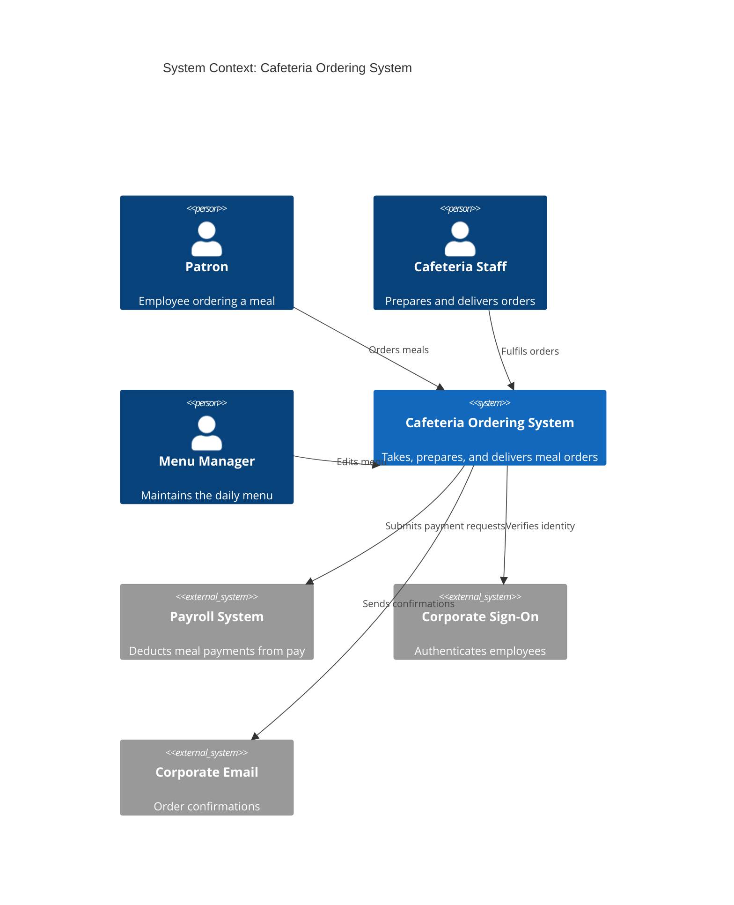
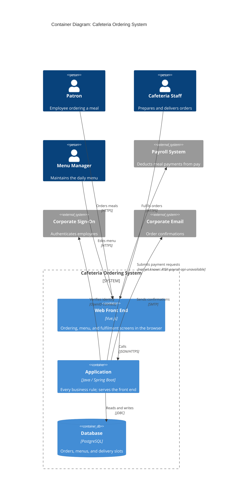

# Architectural Design

**Project:** Drive grader
**Team:** Team 12
**Client:** THE Eric Brown
**Version:** 0.2

---

_**How to use this template.** Instructions appear in italic square brackets. Fill in underneath them and leave them in place until the document is stable. Every section says which checkpoint it is due at. A section that is not due yet stays as it is; do not fill it with guesses to make the document look finished._

_**What this document is.** Your system's **architecture-of-record**: the one map of the whole system, every use case area, every component, every external system, and the few decisions that are expensive to change later. It is **breadth-complete and depth-shallow**. Every part of the system is named, and nothing is designed further than its responsibility. How one use case works inside its component is a design-of-record, which comes in week 7, one per use case area, and it is written against real code._

_**What it is not.** A second copy of your requirements. The specification says what the system must do and how well; this document says how the system is shaped to do it. It **cites** `UC-*`, `CO-*`, `SEC-*`, `PER-*` and the rest by identifier and never restates them. A threshold that appears here and nowhere in the specification is a requirement hiding in the wrong document._

_**The test for what belongs here.** Decide now what is hard to reverse, affects the whole system, and is forced by a quality attribute or a constraint: how many deployables, where the data lives, how users sign in, which external systems you depend on. Leave to per-area design what is local and cheap to change: class names, endpoint shapes, table columns._

_**Structure.** The sections follow **arc42** (Starke and Hruschka), with **C4** diagrams (Simon Brown) for context and containers, written as mermaid so they diff in git. All twelve arc42 sections are here in arc42's order, numbering, and titles. The three subsections whose content another document already owns (the requirements overview, the stakeholders, and the quality requirements overview) are kept as one-line links to that document, so the numbering matches arc42's and nothing is written twice. arc42 orders sections by topic, not by when you write them, so Checkpoint 1 covers sections 1–5, 8, and 9, and sections 6 and 7 come later. The full worked example is Project Pulse's [architecture-of-record](https://github.com/Washingtonwei/project-pulse/blob/main/docs/design/architectural-design.md); read it for the shape, then write your own, because your client's quality attributes are not Project Pulse's.]_

## Identifiers

_[The new identifiers this document creates. Everything else it cites keeps the identifier of the document that owns it.]_

| Space | For | Example |
|---|---|---|
| `KD-<slug>` | Key architectural decisions | `KD-single-deployable` |
| `QS-<slug>` | Quality scenarios | `QS-cross-employee-order-denied` |
| `RISK-<slug>` | Technical risks | `RISK-payroll-api-unavailable` |
| `TD-<slug>` | Technical debt the architecture knowingly carries | `TD-no-rate-limiting` |

_[These are slugs, like every other identifier in your project, so an inserted decision renumbers nothing and a citation says what it points at. Project Pulse uses the same form: `KD-modular-monolith`, `QS-cross-team-denial`.]_

## Revision History

| Version | Date | Author | Change |
|---|---|---|---|
| 0.1 | | | Initial draft for Checkpoint 1 |
| 0.2 | 2026-10-02 | Team 12 | Section 9: architecturally significant requirements and key decisions drawn from the client's Drive Tracker application |

---

## 1. Introduction and Goals

_Due: Checkpoint 1._

### 1.1 Requirements overview

_[Your [specification](../requirements/software-requirements-specification.md) and your [use cases](../requirements/use-cases.md) are the requirements overview. Link them here; do not summarize them.]_

### 1.2 Quality goals

_[The **three** quality attributes that most shape your system, in priority order. Pick them from section 9 of your [specification](../requirements/software-requirements-specification.md) and cite their identifiers. If you cannot rank them, ask your client which one they would give up first; that answer is the ranking._

_These are usually the top rows of the table in section 9.1, and the two do different jobs. Here, say why each goal matters to your client. There, say which decision it forces._

_Example, from the Cafeteria Ordering System:]_

| Priority | Quality goal | Specification handles | Why it shapes the architecture |
|---|---|---|---|
| 1 | _Payroll data stays confidential_ | _`SEC-payroll-auth`, `SEC-employee-own-orders`_ | _Orders are paid by payroll deduction, so an order record carries an employee's pay account. A leak is a legal problem, not a bug._ |
| 2 | _Orders placed before 10:00 are not lost_ | _`ROB-order-persisted`, `AVL-lunch-window`_ | _The lunch rush is the only load that matters, and a lost order is a hungry employee with a payroll charge._ |
| 3 | _Cafeteria staff can run it without IT_ | _`CO-no-dedicated-ops`, `MNT-menu-self-service`_ | _Nobody on the cafeteria side can deploy, restart, or patch anything._ |

### 1.3 Stakeholders

_[Your stakeholders are profiled in section 3.1 of [vision and scope](../requirements/vision-and-scope.md). Link it here; do not copy it.]_

## 2. Architecture Constraints

_Due: Checkpoint 1._

_[The constraints the architecture has to honor. They are already written as `CO-*` in section 2.4 of your specification, and `OE-*` in section 2.3; **list the identifiers here, do not restate them.** Add one sentence only where a constraint narrows an architectural choice in a way that is not obvious from its text._

_Your technology stack is a constraint only if something external fixes it: the client's IT department, an existing system, or the person who maintains this after you graduate. A stack your team chose is a decision, and it goes in section 9 with the alternative you rejected.]_

## 3. Context and Scope

_Due: Checkpoint 1._

_[One C4 context diagram: your system as a single box, every kind of user, and **every external system** it talks to (email, payment, an identity provider, a client database, an LLM, a file store). An external system discovered halfway through the build is a schedule risk you could have seen at the start._

_Your specification already lists the external systems. Every system named in a software interface (`SI-*`, section 8.3), a communications interface (`CI-*`, section 8.5), or a dependency (`DE-*`, section 2.5) is a box here. A box with none of those behind it is an interface your specification is missing, so add it there too._

_This is your project's one context diagram. Section 4.1 of [vision and scope](../requirements/vision-and-scope.md) holds the first draft: redraw it here in C4, then replace the drawing there with a link to this section, so there is one diagram to keep current._

_arc42 divides context into a **business context** (who and what crosses the boundary) and a **technical context** (the channels and protocols). This diagram is the business context. The protocols go on the arrows of the container diagram in section 5.1._

_The **trust boundary** is not drawn here. You name it in writing in section 8.1, as Project Pulse does._

_Example:]_

## 4. Solution Strategy

_Due: Checkpoint 1._

_[Three to five bullets: the few moves that shape everything else. arc42 suggests four kinds: the technology you build on, how the system is divided at the top level, how the quality goals in section 1.2 are met, and any organizational choice that shapes the code (who maintains what, what you buy instead of build)._

_Each bullet is one sentence, and it cites what explains it: the key decision in section 9.2 where one exists, and otherwise the quality goal and the building block in section 5 it shapes. Keep it short; the reasoning lives in section 9. A bullet that cites nothing is either not load-bearing, or it is a decision you have not written down yet._

_Example:]_

- _**One deployable with one managed database** (`KD-deployment-shape`), because nobody on the cafeteria side can operate infrastructure (quality goal 3)._
- _**Payment is the only component that talks to the Payroll System** (section 5.2), so payroll data crosses the trust boundary in exactly one place (quality goal 1)._
- _**Divided by use case area**, Ordering, Menu, and Delivery, each owning its own rules, so a menu change never touches ordering code (quality goal 3, `MNT-menu-self-service`)._

## 5. Building Block View

_Due: Checkpoint 1. This section is most of what your TA checks._

### 5.1 Containers

_[One C4 container diagram: the separately running or separately stored pieces inside your system box. For most projects that is a front end, a back end, and a database, and sometimes a file store. Name each container's technology. Every external system from section 3 appears again here, attached to the container that talks to it._

_Label every arrow with what it does and the protocol it uses ("Sends confirmations [SMTP]"). Those protocols are arc42's technical context._

_Under the diagram, one or two sentences on **why the system is divided this way**, citing `KD-deployment-shape`. A reader who sees three containers should not have to guess why there are not seven._

_Three containers is a normal answer. If you have more than five, check each one against section 9: which decision, driven by which quality attribute, requires it to run separately?_

_Example:]_

_The system is one application and one database because nobody on the cafeteria side can operate more (`KD-deployment-shape`). The front end is a separate container only because it runs in the browser; it ships inside the application's package._

### 5.2 Use case areas and components

_[One row per use case area in your [use cases](../requirements/use-cases.md), taken from the area column of [traceability.md](../traceability.md) section 1, plus one row per **cross-cutting component** that no single area owns (authentication, notifications, file handling, an integration with an external system). A use case area with no row is a part of your system with no home; a component with no area and no cross-cutting reason is one nobody asked for._

_**Responsibility** is one sentence, what the component owns, not how it works. **Depends on** names other components and external systems, never classes. **Status** is `provisional` until the component has been built through at least one use case, and `proven` after that. At Checkpoint 1 every row is `provisional`; Checkpoint 2 turns at least one to `proven`._

_Project Pulse's component tables also name each component's package. They can because its code exists; yours does not yet, so a row here is a name and a responsibility, and packages come with the design-of-record in week 7._

_Example:]_

| Use case area | Component | Responsibility | Depends on | Status |
|---|---|---|---|---|
| _`ORD`_ | _Ordering_ | _Owns an order from placement to cancellation, and the cut-off rules_ | _Menu, Payment, Identity_ | _provisional_ |
| _`MNU`_ | _Menu_ | _Owns daily menus and item availability_ | _Identity_ | _provisional_ |
| _`DEL`_ | _Delivery_ | _Owns delivery slots and the staff's fulfilment queue_ | _Ordering, Notification_ | _provisional_ |
| _(cross-cutting)_ | _Payment_ | _The only component that talks to the Payroll System_ | _Payroll System_ | _provisional_ |
| _(cross-cutting)_ | _Identity_ | _Maps a signed-on employee to a role_ | _Corporate Sign-On_ | _provisional_ |
| _(cross-cutting)_ | _Notification_ | _Sends every email the system sends_ | _Corporate Email_ | _provisional_ |

_[Check before Checkpoint 1: every area in your use case file appears in the first column, and every external system in section 3 appears in some Depends on cell.]_

## 6. Runtime View

_Due: Checkpoint 2. [One sequence diagram, for the use case your proving slice builds, from the user's action through every container and external system it touches. Leave this section empty until the slice exists; a sequence diagram of code nobody has written describes a guess._

_Draw it as a mermaid `sequenceDiagram`, and name the participants exactly as the containers in section 5.1 name them. If the use case calls an external system, show what happens when that system fails or does not answer; arc42 counts error scenarios among the most useful runtime views. Under the diagram, a sentence or two on anything a reader would not guess from it. Cite the use case by its `UC-*` identifier; do not restate its steps.]_

## 7. Deployment View

_Due: Checkpoint 3. [Filled in once your pipeline exists, after week 11. Three things:_

- _**Where each container runs.** Every container in section 5.1 is mapped to the host, service, or device it runs on, in each environment you have (at least development and production). A table is enough; a diagram helps once there are more than two hosts._
- _**How a change gets there.** From a merged pull request to production: what builds it, what tests it, and where it is released first._
- _**What survives a restart.** Which state is in the database or a file store, and which is lost when the application restarts._

_Section 4.4 of [vision and scope](../requirements/vision-and-scope.md) says who can operate the system and where its users are. Cite it; this section says how the deployment meets it.]_

## 8. Crosscutting Concepts

_[arc42 leaves this section an open list of concepts. This template fixes its first entry, 8.1 Security, because Checkpoint 1 asks for the trust boundary; 8.2 holds every other concept.]_

### 8.1 Security

_Due: named at Checkpoint 1, detailed at Checkpoint 2._

_[Four short paragraphs. The last three each cite the `SEC-*` requirement they answer:_

- _**Trust boundary:** the line between what you control and what you do not. Name the container that is the boundary and what sits outside it (the browser, every external system). Every request that crosses it is authenticated and authorized, and it covers every path your deployable answers, framework endpoints included. Project Pulse's Security & Compliance section shows the shape in three sentences._
- _**Authentication:** how a user proves who they are, and who issues the credential (your system, the client's sign-on, a third party)._
- _**Authorization:** the roles, and the rule for what a user may see beyond their role (a patron sees only their own orders). The second part is where most real breaches happen._
- _**Sensitive data:** what personal or regulated data the system stores, in which container, and which external systems receive any of it. How long it is kept and how it is disposed of are already in section 7.4 of your specification; cite them._

_Secrets (passwords, API keys, connection strings) never appear in this document or in the repository. Say where they will live, not what they are.]_

### 8.2 Other concepts

_Due: Checkpoint 1, a subsection for every concept in the table below; then kept current, adding the file that shows each rule once code exists and a new concept whenever one appears. [Anything every component must do the same way. Your agent starts every session with no memory of the last, so a convention that is not written here gets reinvented each time. Write every concept now, while each is still cheap to choose; the last column says when a missing one would start to hurt._

_One short subsection each: the rule in one sentence, why, and the file that shows it done right once one exists. Put the one-line instruction in your charter too, citing this subsection, because the charter is what your agent always reads. Project Pulse's Crosscutting Concepts section is a worked example; its headings differ from this template's.]_

| Concept | The question it settles | When it usually bites |
|---|---|---|
| _Error handling_ | _What does a failure look like to the caller, and where is it caught?_ | _The second endpoint_ |
| _Time and time zones_ | _Whose clock decides a deadline, what zone is stored, and can a test set the time?_ | _The first deadline or "submitted late"_ |
| _API conventions_ | _What shape does every response take, and how are endpoints named?_ | _The second endpoint_ |
| _Code conventions_ | _Which libraries and idioms does every file use, and which are banned? (Formatting belongs to a formatter, not here.)_ | _The first file an agent writes_ |
| _Validation_ | _Where is input checked, and which check is the one that counts?_ | _The first form_ |
| _Configuration and secrets_ | _What differs between development and production, and where does it live?_ | _The first deploy_ |
| _Logging_ | _What is logged, at what level, and what must never be?_ | _The first bug you cannot reproduce_ |
| _Persistence and concurrency_ | _Where does a transaction begin and end, and what happens when two people edit at once?_ | _The first shared record_ |
| _Auditing_ | _Who changed what, and when?_ | _The first "who did this?"_ |
| _Testing_ | _Which kinds of test, at which layer, with what data?_ | _The first pull request_ |

_Example, from the Cafeteria Ordering System:_

**8.2.1 Error handling.** _Every endpoint returns `{ "ok": false, "error": { "code", "message" } }` on failure, produced by one exception handler; no controller builds its own error body, and no response carries an exception's own message. Why: the ordering screen and the menu screen share one error display, and an exception's message can reveal the database behind it. Shown in: `ApiExceptionHandler`._

## 9. Architecture Decisions

_Due: the table and one decision at Checkpoint 1; more as they are made._

### 9.1 Architecturally significant requirements

_[Not every requirement shapes the architecture. The **architecturally significant requirements** are the few that do: quality attributes and constraints where a wrong guess costs a redesign, not a bug fix. Functionality can be delivered by many structures; these are what choose among them._

_Your quality goals from section 1.2 are usually the top rows; cite them by identifier and do not explain them again. This table can also hold what is nobody's goal but still forces structure, such as a `CO-*` constraint._

_List three to six, ranked by importance to your client times difficulty to achieve. Reuse the specification's identifiers, never new ones. **At least one row is a `SEC-*` attribute.** Every system your team builds this year holds some personal data, and if no security requirement appears here, that data's protection was never designed; it will be added later, which is where security bugs come from.]_

| Rank | Requirement | Specification handles | Importance × difficulty | Drives |
|---|---|---|---|---|
| 1 | Users see only their own organization's and students' data | `SEC-authorization`, `SEC-driver-data`, `SCA-organizations` | High × Medium | `KD-org-row-tenancy`, `KD-own-accounts` |
| 2 | A drive survives losing the network or GPS mid-drive | `ROB-external`, `ROB-gps`, `ROB-failure-handling`, `UC-SYNC-sync-offline-data` | High × High | `KD-offline-first-capture` |
| 3 | OBD2 vehicle data reaches the app on the devices graders use | `INT-obd2`, `ROB-obd2`, `CO-pwa`, `CO-capacitor` | High × High | `KD-obd-adapter-layer` |
| 4 | Logging an infraction does not distract the grader | `SAF-interaction`, `PER-infraction` | High × Medium | `KD-offline-first-capture` |
| 5 | Build on the existing application and its deployment pipeline | `CO-existing-application`, `CO-github-actions` | Medium × Low | `KD-deployment-shape` |

`AVL-uptime` and `SCA-concurrent-users` are not listed: the client's existing hosting meets them, and neither forces a structural choice.

### 9.2 Key decisions

_[One entry per key decision (`KD-*`), in the form below; it is what the wider industry calls an architecture decision record (ADR). Checkpoint 1 requires exactly one: **`KD-deployment-shape`**, whether your system ships as one deployable or several, and why. Every team makes this decision, and it is where over-engineering usually shows up first. Add others when you make them; do not invent them to fill the section._

_A decision without a **rejected alternative** is not a decision, it is a description. Name what you did not do and why not, so the next person does not redo the argument._

_A decision that turns out wrong is not deleted or rewritten. Mark it **Superseded by `KD-<new-slug>`** and write the new decision as its own entry, so the reasoning behind both stays readable.]_

**`KD-deployment-shape`: one repository, two deployables (static UI and API), one shared database.** Accepted (inherited from proof of concept).

- **Driving requirements:** `CO-existing-application`; `CO-github-actions`; `CO-capacitor`.
- **Context:** The client's Drive Tracker repository holds the API and the front end together, and one push to `stg` deploys both through the existing GitHub Actions workflow to the client's Docker Swarm host. The database is a MySQL instance on the client's cluster. Expected load is in the low hundreds of users (`SCA-concurrent-users`).
- **Decision:** The Quasar front end is built to static files and served by its own container. The Node.js API runs in its own container. Both live in one repository and deploy together from one push, against one MySQL database.
- **Rejected:** (a) Bundling the front end into the API's package as a single deployable. The Capacitor build needs the front end as a standalone bundle that calls the API from the device, and the client's pipeline already ships the two separately. (b) Splitting the API into services by area (sessions, grading, administration). That would add network calls, more deployments, and failure modes between them, to solve a scaling problem this user count does not have.
- **Trade-off:** The UI and the API can drift apart if only one of the two deploys succeeds, so a release is not finished until both containers report the same version.

**`KD-own-accounts`: Drive Grader issues its own credentials.** Accepted (inherited from proof of concept).

- **Driving requirements:** `SEC-account`; `SEC-permissions`.
- **Context:** Users are parents, students, instructors, and examiners from many unrelated households and driving schools. There is no shared identity provider among them, and the client does not run one.
- **Decision:** The API stores password hashes and issues signed, expiring tokens. Each token carries the user's role and whether they are a platform administrator, and the API checks both on every protected route.
- **Rejected:** An external identity provider or school sign-on. Parents have no common provider, and adding one would put a third-party dependency in front of every drive.
- **Trade-off:** The team owns password reset (`UC-ACCT-reset-password`), credential storage, and the signing secret.

**`KD-org-row-tenancy`: one database, with every tenant-owned row scoped to its organization.** Accepted (inherited from proof of concept).

- **Driving requirements:** `SCA-organizations`; `SEC-driver-data`; `SEC-authorization`.
- **Context:** Several driving schools and many families share one deployment. A parent must see only their own students, and an organization only its own drives.
- **Decision:** All organizations share one database. Every tenant-owned row carries its organization, and parent access is further limited to the students on that parent's roster. The API applies these scopes in the service layer, not in the front end.
- **Rejected:** A separate database or schema per organization. It would multiply migrations and operational work on the client's cluster, and no requirement demands that level of isolation.
- **Trade-off:** One query that forgets its scope leaks data across tenants, so every protected function needs an authorization test with an account from another organization (`SEC-authorization`; see section 10.2).

**`KD-offline-first-capture`: drive data is written on the device first and synced to the API when the network allows.** Accepted (inherited from proof of concept).

- **Driving requirements:** `ROB-external`; `ROB-gps`; `PER-infraction`; `SAF-interaction`; `UC-SYNC-sync-offline-data`.
- **Context:** Drives happen in moving cars, where mobile coverage drops without warning. A grader logs infractions and maneuvers while supervising a teenage driver and cannot stop to retry a failed request.
- **Decision:** During an active drive the front end queues route points, grades, motion events, and OBD2 samples in on-device storage, and uploads them when connectivity returns. The API accepts queued data for an existing session.
- **Rejected:** Online-only capture, where each grade or route point is sent immediately. A dropped connection mid-maneuver would either lose the record or make the grader retry it while the car is moving.
- **Trade-off:** On-device storage is limited in size and can be cleared by the operating system before it syncs. Starting a session still needs the network, because the API assigns the session's identifier. Both are to be recorded as debt in section 11 at Checkpoint 2.

**`KD-obd-adapter-layer`: vehicle data goes through one interface with swappable transports, and iOS uses the native build.** Accepted (inherited from proof of concept).

- **Driving requirements:** `INT-obd2`; `ROB-obd2`; `CO-pwa`; `CO-capacitor`.
- **Context:** The OBD2 adapters connect over Bluetooth. Android browsers can reach them from the PWA, but iOS browsers and home-screen PWAs cannot open Bluetooth at all. The client's near-term milestone is a live brake signal in the app.
- **Decision:** The front end talks to the vehicle through a single connection interface, with interchangeable transports for Web Bluetooth, USB serial, native Bluetooth through Capacitor, and a simulator. The PWA uses whichever transport the browser supports. iOS users need the Capacitor build for OBD2, and everything else works without OBD2 (`ROB-obd2`).
- **Rejected:** (a) PWA only, which leaves every iOS user without vehicle data. (b) Native apps only, which drops the install-free PWA tier the client described for GPS-only use.
- **Trade-off:** Two builds to test, and OBD2 features differ by platform. The simulator lets the team test grading without a car, but it does not prove that a real adapter works.

**`KD-integration-isolated`: only the integration component talks to an organization's external scheduling and student system.** Proposed; the team confirms whether it is in scope this semester.

- **Driving requirements:** `ROB-external`; `INT-integrations`; `SI-SCHOOL-INTEGRATION`; `DE-school-integration`.
- **Context:** An organization can configure its own scheduling and student system. Drive Grader pulls students and appointments from it and pushes finished drive results back, using a per-organization address and key.
- **Decision:** One API component owns every call to that system, its credentials, and the translation of its data into Drive Grader's. When the system fails or does not answer, the component returns an empty result instead of an error, so drives and grading keep working.
- **Rejected:** Calling the external system from each feature that needs its data. That spreads its credentials and data formats across the codebase, and one outage would break several features.
- **Trade-off:** A silent empty result can hide an outage, so a failed call must still be visible to an organization administrator, for example through the connection test.

## 10. Quality Requirements

### 10.1 Quality requirements overview

_[Section 9 of your [specification](../requirements/software-requirements-specification.md) is the overview. Link it here; do not copy it.]_

### 10.2 Quality scenarios

_Due: one scenario at Checkpoint 2; one per top-ranked requirement in section 9.1 by Checkpoint 3._

_[A quality attribute says how good; a scenario says how you will know. Each one is: a **source** does a **stimulus** in an **environment**, the system gives a **response**, and a **measure** tells you it worked. The measure cites the specification's attribute for its number; it never introduces one._

_**Verified by** names the test, or the repeatable manual check, that shows the measure holds. Leave it empty until that test exists; an empty cell is an honest "not yet verified".]_

| ID | Source and stimulus | Environment | Response | Measure | Verified by |
|---|---|---|---|---|---|
| _`QS-cross-employee-order-denied`_ | _A signed-on patron requests another patron's order by its ID_ | _Normal operation_ | _Refused before any order data is read_ | _Every such request is refused and returns no order fields (`SEC-employee-own-orders`)_ | _An integration test that signs in as one patron and requests another patron's order_ |

## 11. Risks and Technical Debt

_Due: Checkpoint 2, kept current after._

_[**Technical** risks and debt only. Business risks are `RI-*` in [vision and scope](../requirements/vision-and-scope.md); do not copy them here. Project risks, such as a teammate dropping the course, belong in neither document. Seed this list from the technical `RI-*` items and from any [OPEN-ISSUES.md](../requirements/OPEN-ISSUES.md) entry whose answer could change the architecture._

_A **risk** might happen: an external system you have never called, a client dataset you have never seen. **Debt** has already happened: a shortcut you took on purpose and intend to pay back. Each row says how you would find out, or how you would fix it._

_A risk written as a category ("security", "performance") is not a risk. Write the mechanism: what fails, and what that breaks.]_

| ID | Type | What could go wrong, and what it breaks | Mitigation or fix | Cites |
|---|---|---|---|---|
| _`RISK-payroll-api-unavailable`_ | _Risk_ | _Nobody has seen the Payroll System's interface. If it only accepts a nightly batch file, ordering cannot confirm payment at order time._ | _Ask for the interface document at the next client meeting; build Payment against a stub until then._ | _`DE-payroll-integration`, `OI-4`_ |

## 12. Glossary

_[Domain terms live in your [project glossary](../requirements/project-glossary.md). Link it and add nothing here unless you need an architecture term your team uses in a special sense.]_

---

## Working this document with your agent

_[Delegate: drawing the C4 diagrams in mermaid from your use case list and your specification's interfaces; checking that every use case area has a component and every external system has a component that depends on it; checking that every identifier this document cites exists in the document that owns it; drafting the rejected alternative for a decision you have already made._

_Keep human: the ranking in section 9.1 and every `KD-*`. The decisions are the part of this document your client and the team that inherits this system will hold you to, and they depend on facts about your client that are not in any file._

_**The specific failure to watch for: over-engineering.** Ask an agent for an architecture and it will propose the one it has seen most often in writing, which is built for a company a thousand times your size: microservices, a message queue, Kubernetes, a cache in front of a database that holds ten thousand rows. Every one of those is a real answer to a problem you do not have, and each one adds something that can break at 2 a.m. with nobody to fix it. For every container and every decision the agent proposes, ask which requirement in section 9.1 forces it. If the answer is none, cut it.]_
