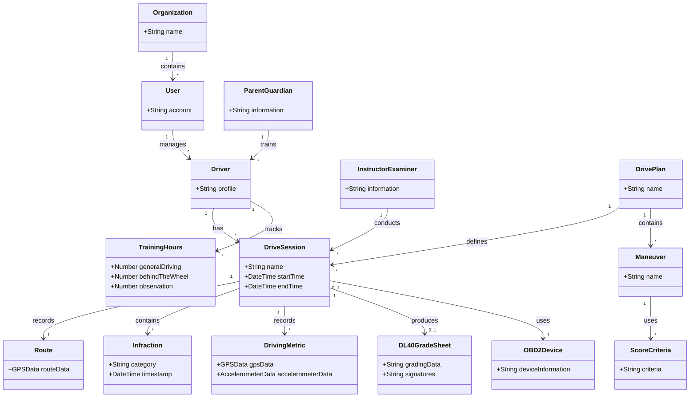

# Software Requirements Specification

**Project:** Drive Grader
**Team:** Team 12
**Client:** Eric Brown
**Version:** 0.1

---

## Identifiers

| Space                     | For                                          | Example                                  |
| ------------------------- | -------------------------------------------- | ---------------------------------------- |
| `FR-<AREA>-<slug>`        | Functional requirements outside any use case | `FR-SAVE-autosave-active`                |
| `UI-<slug>`               | User interface requirements                  | `UI-spa-views`                           |
| `SI-<slug>`               | Software and system interfaces               | `SI-llm-proxy-only`                      |
| `CI-<slug>`               | Communications interfaces                    | `CI-email-notifications`                 |
| `DI-<slug>`               | Data requirements                            | `DI-persist-graph`                       |
| `OE-<slug>`               | Operating environment                        | `OE-supported-browsers`                  |
| `CO-<slug>`               | Design and implementation constraints        | `CO-single-application`                  |
| `AS-<slug>` / `DE-<slug>` | Assumptions and dependencies                 | `AS-supported-browser`, `DE-llm-service` |

Quality attributes use the following prefixes:

* `USE-` — Usability
* `PER-` — Performance
* `SEC-` — Security
* `SAF-` — Safety
* `AVL-` — Availability
* `ROB-` — Robustness
* `SCA-` — Scalability
* `INT-` — Interoperability
* `MNT-` — Maintainability

Requirements cited from other documents retain their own identifiers, such as `UC-*`, `BR-*`, `BO-*`, `SM-*`, and `FEAT-*`.

---

## Revision History

| Date       | Version | Description   | Author  |
| ---------- | ------- | ------------- | ------- |
| 2026-09-23 | 0.1     | Initial draft | Team 12 |

---

# 1. Introduction

## 1.1 The purpose of Drive Grader

Drive Grader is a mobile-first driving training assistant designed to help parents provide behind-the-wheel training to their teenage children. The system provides structure for driving practice by allowing users to track drive time and routes, monitor driving metrics, record infractions, and review driving performance.

The system also supports a digital DL-40 grading workflow for instructors and examiners. The application allows grading items to be arranged to match a specific driving route and supports recording maneuvers as they occur during a drive.

## 1.2 The purpose of this document

This document describes the functional and nonfunctional software requirements for Drive Grader. It provides requirements for the application's behavior, interfaces, data, operating environment, constraints, and quality attributes.

The project is intended to produce a working MVP by the end of the semester, with final project handoff planned around January.

## 1.3 Document conventions

Requirements use the identifier prefixes defined in the Identifiers section.

Functional requirements use EARS-style statements where applicable, including:

* Ubiquitous requirements.
* Event-driven requirements.
* State-driven requirements.
* Optional requirements.
* Unwanted-behavior requirements.

`[TBD]` indicates information that has not yet been established by the project team or client.

Numerical requirements and thresholds are not specified unless they have been established by the project information available to the team.

## 1.4 References

* [Project glossary](project-glossary.md)
* [Vision and scope](vision-and-scope.md)
* [Use cases](use-cases.md)
* [Business rules](business-rules.md)
* [Open issues](OPEN-ISSUES.md)
* Drive Grader Project Brief
* Drive Grader Client Meeting Transcript & Project Notes
* [The Easy Approach to Requirements Syntax (EARS)](https://alistairmavin.com/ears/)

---

# 2. Overall Description

## 2.1 Product perspective

Drive Grader is a mobile-first web application that provides driving-training assistance, drive tracking, and driving evaluation functionality.

The current system uses a Quasar/Vue frontend, a Node.js API backend, MySQL 8, OpenStreetMap for mapping, and Progressive Web App functionality. The project is based on an existing proof-of-concept application that can track a real-time drive using GPS.

The system may also integrate with Bluetooth OBD2 devices to provide additional vehicle data. OBD2 integration is being investigated and tested as part of the project.

The system includes an administration interface for organizations, drive plans, maneuvers, score criteria, session times, and integration settings.

The application may eventually use Capacitor to provide native iOS and Android functionality.

## 2.2 User classes and characteristics

### Parent / Guardian

Parents or guardians who provide behind-the-wheel driving instruction to a teenage driver.

Parents may have little or no formal driver-training expertise and therefore require an intuitive interface that provides structure and guidance during driving practice.

### Student / Driver

The teenage driver receiving driving instruction.

The student's driving sessions, routes, training hours, driving metrics, and recorded infractions may be associated with their driver profile.

### Instructor / Examiner

Driving instructors and examiners who use Drive Grader to provide instruction or evaluate driving performance.

Instructors and examiners may use drive tracking, infraction logging, and the digital DL-40 grading functionality.

### Organization Administrator

A user responsible for managing an organization within Drive Grader.

Organization administrators may manage organizations, drive plans, maneuvers, score criteria, session times, and integration settings.

Exact permissions are [TBD].

### System Administrator

A user responsible for system-level account and access management.

Exact system administrator permissions are [TBD].

## 2.3 Operating environment

### Client devices

The system shall be designed as a mobile-first responsive web application.

The application shall support Progressive Web App functionality.

The application may later be wrapped using Capacitor to provide native iOS and Android functionality.

### Frontend

The frontend shall use Quasar with Vue.

### Backend

The API shall use Node.js.

### Database

The backend shall use MySQL 8.

### Mapping

The system shall use OpenStreetMap for mapping and route visualization.

### Development environment

Babbage is used for applicable development and testing activities.

Tailscale is used as part of the team's development and network environment where applicable.

### OBD2 environment

The project has Bluetooth OBD2 devices available for testing.

OBD Home is used to connect to and test the available OBD2 devices.

Specific supported browsers, browser versions, operating-system versions, and minimum device requirements are [TBD].

**OE-responsive-web:** The system shall provide a responsive interface across supported screen sizes.

**OE-mobile-access:** The system shall support access through supported mobile devices.

**OE-pwa:** The system shall support deployment as a Progressive Web App.

## 2.4 Design and implementation constraints

**CO-frontend-framework:** The frontend shall use Quasar with Vue.

**CO-backend:** The backend API shall use Node.js.

**CO-database:** The system shall use MySQL 8 as its backend database.

**CO-mobile-first:** The application shall be designed as a mobile-first application.

**CO-pwa:** The initial application shall support Progressive Web App functionality.

**CO-capacitor:** Capacitor may be used to provide native mobile functionality where required.

**CO-mapping:** Mapping functionality shall use OpenStreetMap.

**CO-existing-application:** The project shall build upon the client's existing Drive Grader proof of concept where appropriate.

**CO-obd2-testing:** Available OBD2 devices shall be used for testing the planned vehicle-data integration.

**CO-obd-home:** OBD Home may be used during development to connect to and test the OBD2 devices.

**CO-github:** The project shall use the client's GitHub organization for source-code management.

**CO-github-actions:** GitHub Actions shall be used for the existing automated deployment process to the staging environment where applicable.

**CO-mvp:** The project shall prioritize a working MVP by the end of the semester.

## 2.5 Assumptions and dependencies

**AS-device-gps:** Drive tracking assumes that the user's device provides GPS access.

**AS-device-accelerometer:** Accelerometer-based driving metrics depend on device accelerometer access.

**AS-supported-browser:** Users are assumed to access the application through a supported browser or supported mobile application environment.

**AS-existing-poc:** The existing Drive Grader proof of concept provides a starting point for the project.

**DE-openstreetmap:** Mapping functionality depends on OpenStreetMap.

**DE-mysql:** Backend data storage depends on MySQL 8.

**DE-obd2-hardware:** Optional vehicle-data functionality depends on compatible OBD2 hardware.

**DE-obd2-data:** OBD2 functionality depends on whether the selected devices provide the vehicle data required by the application.

**DE-obd-home:** OBD2 testing depends on communication between OBD Home and the selected OBD2 hardware.

**DE-capacitor:** Native mobile functionality depends on implementation of Capacitor.

**DE-github:** Development depends on access to the client's GitHub organization.

**DE-github-actions:** Automated staging deployment depends on the existing GitHub Actions configuration.

**DE-ai:** AI functionality is optional and depends on the team identifying a useful application for AI within Drive Grader.

---

# 3. Project Glossary

See [project-glossary.md](project-glossary.md).

---

# 4. Vision and Scope

See [vision-and-scope.md](vision-and-scope.md).

Business requirements, objectives, metrics, and scope are maintained in that document.

---

# 5. Functional Requirements

## 5.1 Use cases

See [use-cases.md](use-cases.md).

Use cases define the primary user interactions and system behavior associated with those interactions.

Known use-case areas include:

* Starting a drive.
* Ending a drive.
* Tracking a drive.
* Logging driving infractions.
* Reviewing a completed drive.
* Tracking training hours.
* Performing digital DL-40 grading.
* Managing driver information.
* Managing organizations and accounts.

## 5.2 Non-use-case functional requirements

### Account and access management

**FR-ACCOUNT-manage:** The system shall provide functionality for managing user accounts.

**FR-ACCOUNT-access:** The system shall control access to functionality according to the user's assigned permissions.

**FR-ACCOUNT-organizations:** The system shall support organizations within the administration system.

### Drive sessions

**FR-DRIVE-start:** When a user begins a drive session, the system shall begin recording available drive information.

**FR-DRIVE-save:** When a drive session ends, the system shall save the associated drive information.

**FR-DRIVE-route:** While a drive session is active, the system shall record available GPS route information.

**FR-DRIVE-summary:** When a drive session ends, the system shall provide the recorded route and logged infractions for review.

### Driving metrics

**FR-METRICS-gps:** While a drive session is active, the system shall record available GPS information.

**FR-METRICS-speed:** Where available from GPS data, the system shall record driving speed.

**FR-METRICS-accelerometer:** Where device accelerometer data is available, the system shall record accelerometer information.

**FR-METRICS-braking:** Where supported by available sensor data, the system shall record information relevant to hard braking.

**FR-METRICS-turning:** Where supported by available sensor data, the system shall record information relevant to hard turns.

**FR-METRICS-gforce:** Where supported by available sensor data, the system shall record G-force information.

Exact thresholds for identifying hard braking, hard turns, or other driving events are [TBD].

### Infraction logging

**FR-INFRACTION-record:** When a parent, instructor, or examiner selects a grading topic during an active drive, the system shall record the selected infraction.

Known grading topics include:

* Following distance.
* Smooth braking.
* Failure to control speed.
* Lane discipline.
* Situational awareness.

The complete list of grading categories and scoring criteria is [TBD].

### Training-hour tracking

**FR-HOURS-record:** The system shall support recording driving-training hours.

**FR-HOURS-categories:** The system shall support tracking hours by training category.

Known categories include:

* General logged driving.
* Behind-the-wheel instruction.
* Observation.

**FR-HOURS-progress:** The system shall support displaying progress toward the applicable training-hour requirements.

The known requirements are:

* 30 hours of general logged driving.
* 7 hours of behind-the-wheel instruction.
* 7 hours of observation.

### Digital DL-40 grading

**FR-DL40-digital:** The system shall provide a digital grading workflow based on the Texas DL-40.

**FR-DL40-reorder:** The system shall allow DL-40 grading items to be reordered to match a specific driving route.

**FR-DL40-driver:** The system shall allow driver information to be associated with a DL-40 grading session.

**FR-DL40-guardian:** The system shall allow parent or guardian information to be associated with a DL-40 grading session.

**FR-DL40-signatures:** The system shall support capturing required signatures.

**FR-DL40-maneuvers:** The system shall support grading driving maneuvers including:

* Parking.
* Merge.
* Lane change.
* Approach-to-corner.
* Traffic signal.
* Traffic sign.
* Left turns.
* Right turns.
* Backing.

**FR-DL40-route-order:** During a grading session, the system shall allow grading items to be recorded in the order they occur on the route.

**FR-DL40-output:** When grading is complete, the system shall support producing a completed DL-40 grade sheet.

Exact DL-40 fields, scoring rules, output formatting, and printing requirements are [TBD].

### Administration

**FR-ADMIN-organizations:** The system shall support organization management.

**FR-ADMIN-drive-plans:** The system shall support drive-plan management.

**FR-ADMIN-maneuvers:** The system shall support maneuver management.

**FR-ADMIN-score-criteria:** The system shall support score-criteria management.

**FR-ADMIN-session-times:** The system shall support session-time management.

**FR-ADMIN-integrations:** The system shall support integration-setting management.

Exact administrative permissions are [TBD].

### OBD2

**FR-OBD2-connect:** Where OBD2 functionality is included, the system shall support connection to a compatible OBD2 device.

**FR-OBD2-bluetooth:** Where supported by the device and application environment, the system shall communicate with the OBD2 device over Bluetooth.

**FR-OBD2-data:** Where supported by the connected device, the system shall receive available vehicle data.

**FR-OBD2-correlate:** Where supported, the system shall allow OBD2 data to be associated with GPS and other drive-session data.

Vehicle information currently being investigated includes:

* Engine speed/RPM.
* Turn-signal use.
* Brake-light activation.
* Other available engine and vehicle metrics.

Whether the selected OBD2 devices provide turn-signal and brake-light information is [TBD].

### Optional AI

**FR-AI-optional:** AI functionality is optional for the initial system.

**FR-AI-analysis:** Where implemented, AI may analyze driving-session metrics.

**FR-AI-comparison:** Where implemented, AI may compare driving-session metrics with other drives.

The specific AI functionality and requirements are [TBD].

---

# 6. Business Rules

See [business-rules.md](business-rules.md).

Business rules are maintained in the business-rules document rather than duplicated here.

Known business-rule areas include:

* Required driving hours.
* DL-40 grading requirements.
* Driver and guardian information.
* Grading criteria.
* Organization and account permissions.

---

# 7. Data Requirements

## 7.1 Business domain model

The following preliminary domain entities are based on the known Drive Grader functionality:

This is a preliminary domain model. The final business entities and relationships are [TBD].

## 7.2 Data dictionary

| Entity            | Data                        | Description                                                       |
| ----------------- | --------------------------- | ----------------------------------------------------------------- |
| User              | Account information         | Information required to manage a user account and access.         |
| Organization      | Organization information    | Information associated with an organization using Drive Grader.   |
| Driver            | Driver profile              | Information identifying the person receiving driving instruction. |
| Parent/Guardian   | Parent/guardian information | Information associated with the person providing instruction.     |
| Drive Plan        | Plan information            | Information defining a driving plan.                              |
| Drive Session     | Session information         | Information about a recorded driving session.                     |
| Route             | GPS route data              | GPS information representing the route driven.                    |
| Infraction        | Category and timestamp      | A driving mistake recorded during a drive.                        |
| Driving Metric    | GPS/accelerometer data      | Sensor information collected during a drive.                      |
| Training Hours    | Hours by category           | Recorded training time for the driver.                            |
| Maneuver          | Maneuver information        | A driving maneuver used during training or grading.               |
| Score Criteria    | Criteria information        | Criteria used to evaluate driving performance.                    |
| DL-40 Grade Sheet | Grading data/signatures     | Digital DL-40 grading information and signatures.                 |
| OBD2 Device       | Device/vehicle information  | Information associated with a connected OBD2 device.              |

Exact data types, validation rules, defaults, and required fields are [TBD].

## 7.3 Reports

### Drive Session Summary

The system shall provide a summary of a completed drive containing, where available:

* The route driven.
* Logged infractions.
* Infraction timestamps.
* Available driving metrics.

The exact format is [TBD].

### Training-Hour Progress

The system shall support displaying recorded training hours and progress toward applicable training-hour requirements.

The exact format is [TBD].

### DL-40 Grade Sheet

The system shall support producing a completed DL-40 grade sheet following a digital grading session.

The exact output format is [TBD].

## 7.4 Data acquisition, integrity, retention, and disposal

### Data acquisition

The system may acquire data from:

* User-entered account information.
* Driver information.
* Parent/guardian information.
* GPS.
* Device accelerometer.
* OBD2 devices.
* Drive-session grading inputs.
* DL-40 grading inputs.
* Captured signatures.

### Data integrity

The system shall associate drive data with the appropriate drive session.

The system shall associate infractions with the drive session in which they were recorded.

The system shall associate training hours with the appropriate driver and training category.

Additional data-integrity requirements are [TBD].

### Data retention

The required retention period for drive sessions, routes, infractions, training hours, account information, and grading records is [TBD].

### Data disposal

The process for deleting or disposing of stored account, drive, and grading data is [TBD].

---

# 8. External Interface Requirements

## 8.1 User interfaces

**UI-responsive:** The application shall provide a responsive user interface designed for mobile-first use.

**UI-pwa:** The application shall support Progressive Web App functionality.

**UI-drive-session:** The application shall provide an interface for starting and ending drive sessions.

**UI-live-route:** The application shall provide an interface for viewing the route during an active drive.

**UI-infraction:** The application shall provide an interface for logging driving infractions.

**UI-summary:** The application shall provide an interface for reviewing completed drive information.

**UI-dl40:** The application shall provide an interface for digital DL-40 grading.

**UI-administration:** The application shall provide an administration interface for supported administrative functionality.

The client has not specified a particular visual design. The primary design requirement is that the application be intuitive.

Specific accessibility requirements, layouts, colors, typography, and other visual standards are [TBD].

## 8.2 Hardware interfaces

### Mobile device GPS

**SI-GPS:** The system shall support receiving GPS location information from the user's mobile device where available.

GPS information shall be used to track and display the route driven.

### Mobile device accelerometer

**SI-ACCELEROMETER:** Where supported by the mobile device, the system shall support receiving accelerometer information.

Accelerometer information shall be used to support driving metrics.

### OBD2 device

**SI-OBD2:** Where OBD2 functionality is included, the system shall support communication with compatible OBD2 devices.

**SI-OBD2-BLUETOOTH:** The planned OBD2 devices communicate with a phone using Bluetooth.

**SI-OBD2-DATA:** Where supported by the device, the system shall receive available vehicle data.

OBD Home may be used to connect to and test the OBD2 devices during development.

The exact vehicle data available from the selected devices is [TBD].

## 8.3 Software interfaces

### OpenStreetMap

**SI-OSM:** The system shall use OpenStreetMap for mapping and route visualization.

### Node.js API

**SI-NODE:** The frontend shall communicate with the Node.js backend API.

The exact API endpoints and data formats are [TBD].

### MySQL 8

**SI-MYSQL:** The backend shall use MySQL 8 for persistent data storage.

### Quasar/Vue

**SI-QUASAR:** The user interface shall be implemented using Quasar with Vue.

### Capacitor

**SI-CAPACITOR:** Where implemented, Capacitor shall provide native mobile access to supported device capabilities.

### OBD Home

**SI-OBDHOME:** OBD Home may be used as a development/testing tool for communicating with the available OBD2 devices.

OBD Home is not currently established as a required production dependency.

### GitHub and GitHub Actions

**SI-GITHUB:** The project source code shall be maintained within the client's GitHub organization.

**SI-GITHUB-ACTIONS:** GitHub Actions shall support the existing automated deployment process to the staging environment where applicable.

### AI

**SI-AI:** Where AI functionality is implemented, the system may communicate with an AI service or model.

The specific AI service and interface are [TBD].

## 8.4 API document

The Drive Grader backend shall provide an API implemented using Node.js.

The API shall provide communication between the frontend and backend.

The complete API documentation and endpoint definitions are [TBD].

## 8.5 Communications interfaces

The system shall support communication between the frontend and backend through the application API.

Where supported, the system shall communicate with OBD2 devices over Bluetooth.

The system may communicate with external mapping and AI services.

Tailscale may be used as part of the team's development and network environment.

Specific communication protocols and data formats are [TBD].

---

# 9. Quality Attributes

## 9.1 Usability

**USE-mobile-first:** The application shall be designed primarily for use on mobile devices.

**USE-responsive:** The application shall provide a responsive interface across all supported screen sizes.

**USE-intuitive:** At least **90% of representative test users** shall be able to complete the primary Drive Grader tasks without assistance.

**Measurement:** Usability shall be measured through user testing. Test users shall be asked to perform primary tasks including starting a drive, logging an infraction, and reviewing a completed drive. The percentage of users who successfully complete the tasks without assistance shall be recorded. The target is at least 90%.

## 9.2 Performance

**PER-drive-tracking:** While a drive is active, the system shall support real-time GPS tracking where required device access is available.

**PER-infraction:** During an active drive, the system shall record a selected infraction within **2 seconds** of the user's selection.

**PER-route:** The system shall display the route associated with a drive session within **3 seconds** after the route data is requested.

**Measurement:** Performance shall be measured using timed functional tests on supported devices and network conditions. The response time for recording infractions and displaying recorded route information shall be measured from user action/request to completion. At least 90% of measured operations shall meet the specified response-time targets.

## 9.3 Security

**SEC-account:** The system shall provide account access controls.

**SEC-permissions:** The system shall restrict functionality according to applicable user permissions.

**SEC-driver-data:** The system shall associate driver information and drive data with the appropriate account or organization.

**SEC-authorization:** **100% of protected functions** shall require appropriate authorization before access is granted.

**Measurement:** Security shall be measured through authorization testing. Each protected function shall be tested using authorized and unauthorized accounts. The test shall verify that authorized users can access permitted functions and unauthorized users are denied access. The target is 100% correct authorization behavior.

## 9.4 Safety

**SAF-driving:** The system is intended to be used during driving instruction and evaluation.

**SAF-interaction:** The primary drive-tracking functionality shall require **0 unnecessary user interactions** while the vehicle is actively moving.

**Measurement:** Safety shall be measured through a review and functional test of the active-drive interface. Testers shall verify that GPS tracking and other required drive-session functionality can operate without requiring unnecessary interaction from the driver while the vehicle is moving. Any interaction identified as unnecessary for the driving task shall be documented and corrected.

## 9.5 Availability

**AVL-system:** The application shall be available through its supported deployment environment.

**AVL-uptime:** The system shall maintain at least **99% availability** during scheduled operating periods.

**Measurement:** Availability shall be measured using application uptime monitoring. The percentage of scheduled operating time during which the application is accessible and functional shall be calculated as:

`Availability = (Total scheduled time - downtime) / Total scheduled time × 100`

The target is at least 99% availability.

## 9.6 Robustness

**ROB-gps:** If GPS data is unavailable, the system shall handle the missing GPS information without preventing functionality that does not require GPS.

**ROB-obd2:** If an optional OBD2 device is unavailable, the system shall support functionality that does not depend on OBD2 data.

**ROB-device-api:** If a required device API is unavailable, the system shall handle the unavailable functionality.

**ROB-external:** If an external service becomes unavailable, the system shall handle the unavailable service.

**ROB-failure-handling:** **100% of defined failure scenarios** shall be handled without causing the application to crash.

**Measurement:** Robustness shall be measured by simulating defined failure conditions, including loss of GPS, loss of OBD2 connectivity, unavailable device APIs, and unavailable external services. Each scenario shall be tested to verify that the application remains usable for functionality that does not depend on the failed service. The target is 100% successful handling of defined failure scenarios.

## 9.7 Scalability

**SCA-organizations:** The system shall support multiple organizations within the administration system.

**SCA-concurrent-users:** The system shall support at least **100 concurrent users** while maintaining the application's required functionality.

**Measurement:** Scalability shall be measured through load testing with at least 100 concurrent users performing representative application tasks. The system shall be monitored for errors, failed requests, and unacceptable performance degradation during the test.

## 9.8 Interoperability

**INT-obd2:** Where implemented, the system shall support communication with compatible OBD2 devices.

**INT-mobile:** Where implemented, the system shall support native mobile functionality through Capacitor.

**INT-mapping:** The system shall use OpenStreetMap for mapping.

**INT-api:** The frontend and backend shall communicate through the Node.js API.

**INT-integrations:** **100% of supported external integrations** shall pass their defined integration tests.

**Measurement:** Interoperability shall be measured through integration testing of supported interfaces, including the frontend-to-backend API, MySQL database connection, OpenStreetMap integration, and supported OBD2 devices where implemented. Each supported integration shall be tested for successful communication and data exchange. The target is 100% of defined integration tests passing.

## 9.9 Maintainability

**MNT-quasar:** The frontend shall use Quasar/Vue.

**MNT-node:** The backend shall use Node.js.

**MNT-mysql:** The backend shall use MySQL 8.

**MNT-existing:** The project shall build upon the existing proof of concept where appropriate.

**MNT-documentation:** The project shall maintain documentation necessary for continued development and final project handoff.

**MNT-documentation-completeness:** **100% of major system components** shall have sufficient documentation for continued development and maintenance.

**Measurement:** Maintainability shall be measured through a documentation review before final project handoff. Major components shall include the frontend, backend API, database, deployment process, and major external integrations. Each component shall be checked for setup, configuration, and maintenance documentation. The target is 100% documentation coverage of major components.

---

# 10. Internationalization and Localization

Drive Grader is initially intended for use in Texas and incorporates Texas driver-training and road-test requirements.

Known localization considerations include:

* Texas DL-40 requirements.
* Driving-hour requirements.
* Geographic route information.
* Date and time information.
* Driving measurements.

The supported language, exact locale, date/time format, and unit requirements are [TBD].

---

# 11. Other Requirements

## 11.1 Project delivery

The project is expected to produce a working MVP by the end of the semester.

Final project handoff is planned around January.

The exact final delivery date and final MVP feature list are [TBD].

## 11.2 Development and deployment

The project uses the client's GitHub organization for source-code management.

GitHub Actions are used to automatically deploy pushed code to the staging environment.

The team may use AI coding tools provided by the client.

Babbage may be used for development and testing.

Tailscale may be used as part of the development and network environment.

## 11.3 Optional and future functionality

The following functionality is optional, under investigation, or intended for future development:

* OBD2 vehicle-data integration.
* Turn-signal detection through vehicle data.
* Brake-light detection through vehicle data.
* Camera/video through the phone.
* AI-based driving-session analysis.
* AI comparison of driving sessions.
* Native iOS/Android deployment using Capacitor.
* Fleet tracking.
* Parent observation of instructor/student progress.
* Additional external integrations.

## 11.4 Open issues

The following issues remain to be determined:

1. Can the selected OBD2 devices provide turn-signal and brake-light data?
2. How does OBD2 integration behave with electric vehicles?
3. Is PWA functionality sufficient for the required Bluetooth/OBD2 device access?
4. Is a Capacitor implementation required for the final product?
5. What exact browser and operating-system versions must be supported?
6. What exact user roles and permissions are required?
7. What are the complete DL-40 fields and grading rules?
8. What are the exact data-retention and disposal requirements?
9. What authentication and security requirements must be implemented?
10. What performance thresholds should be established?
11. What AI functionality, if any, should be included in the MVP?
12. What is the final MVP feature list?

---

## Working this document with your agent

AI tools may be used to assist with converting project requirements into EARS-style requirements, checking references to other project documents, identifying duplicated requirements, and drafting testable quality attributes.

All generated requirements should be verified against the client meeting notes, project brief, existing application, and decisions made by the project team.

Numerical thresholds, browser versions, retention periods, security commitments, and other precise requirements should not be added unless they are supported by the client, existing system, measurements, or an explicit decision made by the project team.
