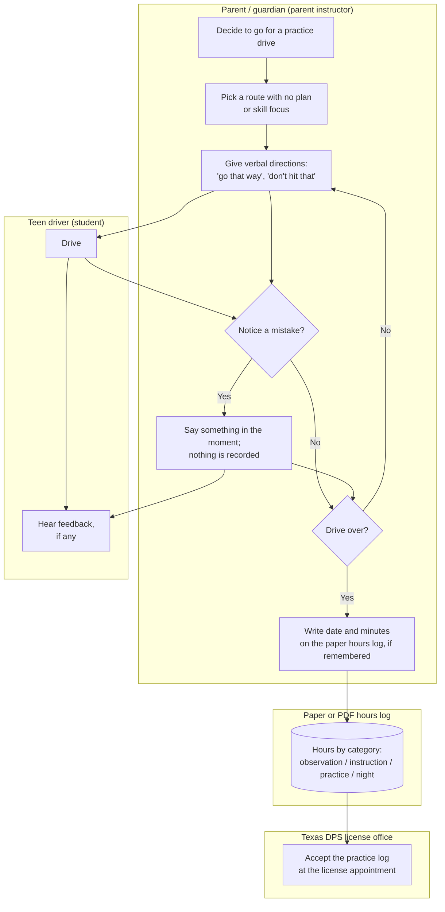
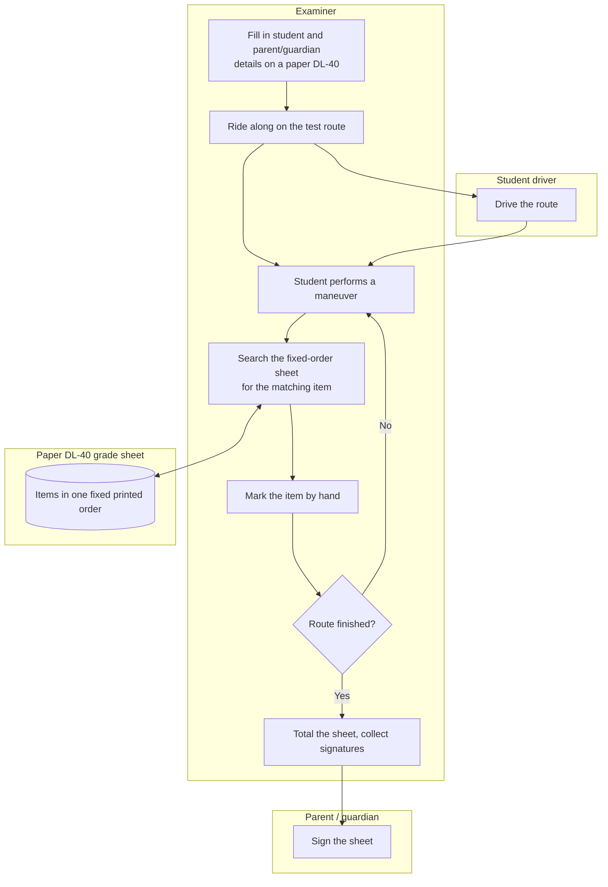
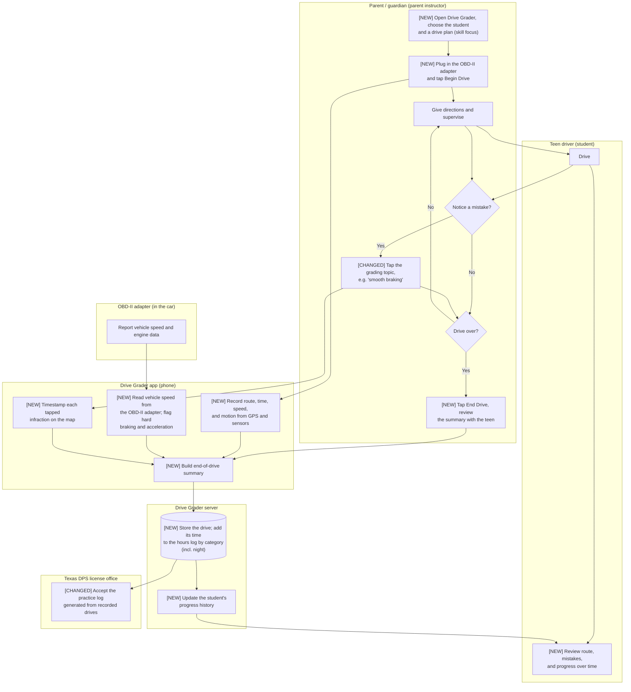
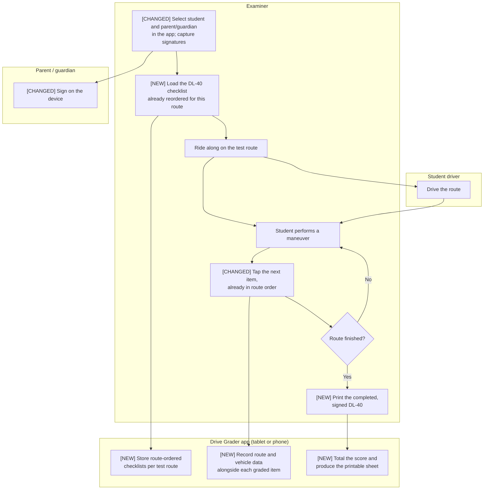
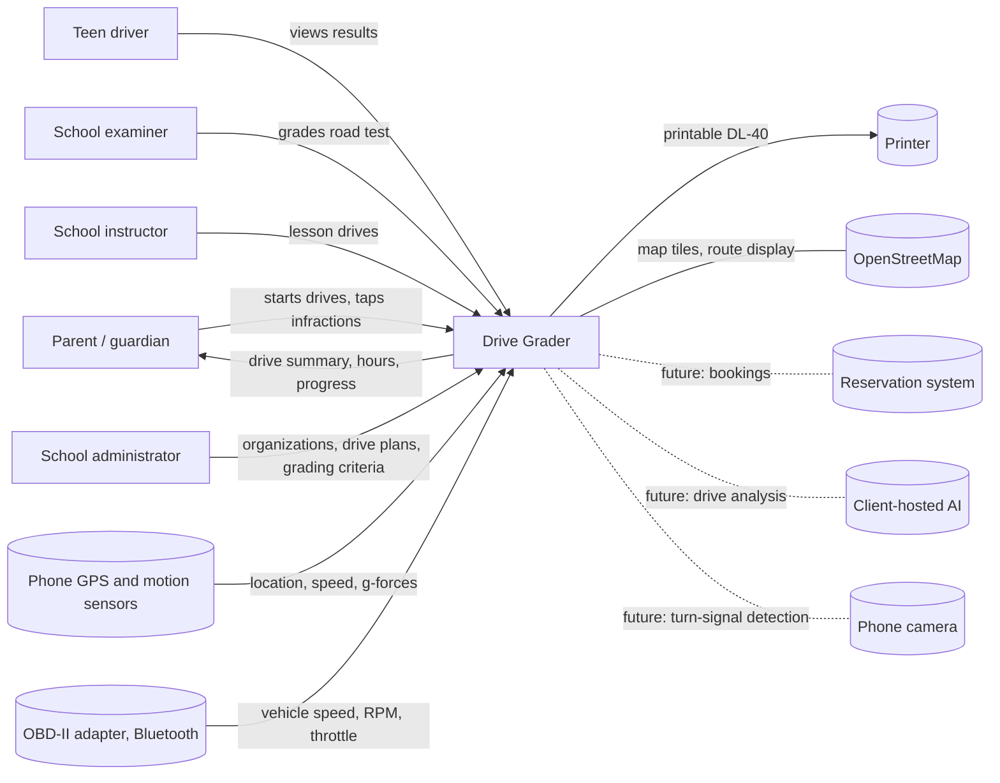

# Vision and Scope

**Project:** Drive Grader
**Team:** Team 12
**Client:** Eric Brown
**Version:** 0.1

---

_**How to use this template.** Every section below opens with an instruction in italic square brackets: what the section is for, how to produce it, a worked example, and a checklist. Fill in the section underneath the instruction. **Leave the instructions in the file until the document is stable.** They are context for you, for the teammate who writes a later section, and for your AI teammate, which reads this file every time it works on your project._

_**This document has two readers.** Your client has to recognize their own business in it, so avoid jargon they would not use. Your AI teammate has to build from it, so avoid a claim it cannot check. When the two pull against each other, write for the client and put the precision in the use cases._

_**Work it with your agent, not instead of it.** Give the agent this template, your one-page project brief, and your meeting notes, then put it in a role: "You are an experienced business analyst. Using the instructions in this template, draft section X, and list every question you cannot answer from what I gave you." The questions it cannot answer are the point. They go in [OPEN-ISSUES.md](OPEN-ISSUES.md) and they become the agenda for your next client meeting. What the agent cannot do is decide which of its questions deserve your client's limited time, or tell enthusiasm apart from commitment. That judgment is yours._

> **Drafting conventions used in this version.** Any number the client has **not** stated is marked **(proposed)** and has a matching entry in [OPEN-ISSUES.md](OPEN-ISSUES.md). Numbers with no mark come from the client brief, the meeting notes, or a cited public source. A baseline recorded as **"not tracked today"** is a finding, not a gap.

## Identifiers in this document

_Identifiers here are **name-based slugs**, never numbers._

| Space | Shape | Example |
|---|---|---|
| Business objective | `BO-<slug>` | `BO-grading-time` |
| Success metric | `SM-<slug>` | `SM-submission-rate` |
| Risk | `RI-<slug>` | `RI-cloud-cost` |
| Assumption or dependency | `AS-<slug>` | `AS-client-maintains-stack` |
| Feature | `FEAT-<slug>` | `FEAT-performance-tracking` |

_Coin each slug from the concept itself: short, kebab-case, unique within its space. **Never renumber, rename, or repoint an identifier.** A new item gets a new slug; a retired item keeps its slug and is marked withdrawn. Cite items by identifier, never by position in a list ("the third objective")._

_Why this matters more with an agent than it used to: ask an agent to insert a new objective into a list numbered `BO-1` through `BO-6` and it has two options. Renumber everything, silently breaking every citation in your use cases and your specification, or append out of order. No test you can write detects either one. A slug has neither failure mode, and it tells a reader what the item is at the place it is cited._

## Revision History

| Date | Version | Description | Author |
|---|---|---|---|
| 2026-09-25 | 0.1 | Initial draft from the client brief (2026-08-27), client meeting #1 (2026-09-08), team meetings #2–#4 (2026-09-15 to 2026-09-22), and the team's OBD-II research notes | Syrah Omar (Team 12) |

---

## 1. Introduction

_[This document defines the goals, purpose, and boundaries of the project. It gives every stakeholder a shared understanding of what the software is for and the context it operates in: the business problem being solved, how the software fits into the client's world, and where the line falls between what is in scope and what is not.]_

### 1.1 Background

_[Summarize the rationale and context for the new product, or for the changes to an existing one. Describe the situation that led to the decision to build it.]_

_**Step 1: Describe the business.** Introduce the organization. Cover what it does (industry, products, services), its size (employees, locations), and the goals that relate to the problem you are solving._

_Example: "The client, XYZ Logistics, is a mid-sized shipping company that specializes in last-mile delivery services for e-commerce businesses. The company operates in five major cities, employs 200 delivery staff, and handles over 10,000 deliveries per day. The goal is to optimize delivery efficiency and customer satisfaction."_

_**Checklist:** Would a reader who has never heard of this organization understand what it does and why this project exists?]_

The client, Eric Brown, owns a driving school in Texas. The school employs driving **instructors**, who give behind-the-wheel lessons, and road-test **examiners**, who conduct the driving portion of the license test, and it operates a fleet of training vehicles. The school's size (staff, locations, vehicles, students per year) has not yet been stated (`OI-school-size`).

In Texas a teen can complete driver education in one of two ways: through a licensed driving school, or through **Parent-Taught Driver Education (PTDE)**, in which a parent or guardian acts as the instructor. About 120,000 Texas students take the parent-taught route each year (client brief). It is popular because it is inexpensive and requires no instructor qualifications, but, in the client's words, "the vast majority of them are not taught well." Parents do not know what to look for or how to teach; they "just get in the car and say things like 'go that way' and 'don't hit that cone'." Before the road test, a PTDE student must also complete 44 hours of logged driving: 7 hours of in-car observation, 7 hours of behind-the-wheel instruction, and 30 hours of supervised practice. In practice, the client says, nobody verifies these hours.

**Drive Grader** began with a narrower problem inside the client's own school. Examiners grade the road test on a fixed-order paper form, the **DL-40** grade sheet, while every test route visits its required maneuvers in a different order, so examiners hunt up and down the sheet during the test. The Texas Department of Public Safety (DPS) approved the client's request to grade electronically and print the sheet afterward. The client then saw that the same tool, with the grading criteria examiners actually use, could give parents the structure they lack.

The client has a partially built **proof of concept**: a mobile-first web app that records a practice drive on a map using the phone's GPS and motion sensors, lets the supervising adult tap a grading topic each time the student makes a mistake, shows the route and mistakes afterward, and includes a digital DL-40 mode and an administration panel. The client describes it as "a basic tool that needs lots of tweaking to make it a viable product." This project extends it. The client's top request for this semester is to connect an inexpensive in-car diagnostic device (**OBD-II adapter**) so the app records real vehicle data, such as speed, hard braking, and ideally turn-signal use, alongside the drive. The team delivers a working MVP by the end of the fall 2026 semester and hands the project off to the client around January 2027.

### 1.2 Current Process Flows (As-Is Process Flows)

_[Most projects require everyone involved to have a firm grasp of the business process being created, replicated, or improved. Without that understanding there is little chance users adopt the new solution. Process flows are the most effective model for building it.]_

_**Step 1: Diagram the current process.** Draw the process people execute **today**, before your software exists, as a mermaid flowchart with **one subgraph per actor** (roles, departments, existing systems). Show the sequence of activities, the decision points, and the handoffs between actors._

_Diagrams in this project are authored as mermaid inside the Markdown file, never exported from a drawing tool as an image. A picture of a diagram is invisible to your AI teammate and unreadable in a diff; a mermaid block is text it can read and revise. A skeleton to start from:_

    ```mermaid
    flowchart TD
      subgraph Student
        A[Open the shared spreadsheet] --> B[Type last week's activities]
      end
      subgraph Instructor
        C[Review the updated sheets] --> D{Complete?}
        D -- No --> E[Email the student]
        D -- Yes --> F[Enter the grade in the LMS]
      end
      B --> C
    ```

_**Step 2: Write the prose.** Not every reader reads diagrams. Explain the flow in a paragraph underneath it._

_**Step 3: List the current tools.** Enumerate what the process runs on today (spreadsheets, paper schedules, email, a legacy system) and give the limitation of each._

_Example: "XYZ Logistics relies heavily on Excel spreadsheets for order management. Printed delivery schedules are distributed to drivers daily. These tools lack automation, making the process prone to human error and delays."_

_**Step 4: Name the pain points.** Highlight the inefficient, slow, or error-prone steps, using one or two specific examples rather than a general complaint._

_Inefficiency example: "Manual entry of order details into Excel causes delays and transcription errors. During peak season, order entries pile up, delaying processing and delivery."_

_Time example: "Printing and distributing delivery schedules to drivers takes 2 hours daily, cutting into time available for deliveries."_

_**Step 5: Write for an outsider.** Assume your reader knows nothing about this domain. Define every domain term on first use and add it to the [project glossary](project-glossary.md)._

_**Checklist:** Is the business context clear to someone unfamiliar with it? Does the flow give step-by-step detail? Are all actors and tools described? Are the inefficiencies illustrated with specific examples? Is there a mermaid diagram with one subgraph per actor?]_

Two processes matter today. Both are described as they run **without** Drive Grader; the proof of concept is not yet in regular use (`OI-poc-usage`).

#### Flow A: Parent-taught practice drive



A parent who has chosen PTDE decides to take the teen out driving. There is usually no plan for which skills to practice. During the drive the parent gives directions and reacts to mistakes verbally, based on their own driving habits rather than the criteria an examiner will use on the road test (for example, stopping exactly at the stop line, or looking both ways at an intersection with no stop sign, which examiners call "approach to corner"). Nothing about the drive is recorded except, if the parent remembers, the date and duration on a paper or PDF hours log. That log is presented at the provisional-license appointment; the client reports that in practice nobody checks it.

#### Flow B: Road test at the client's school



Each test route is designed to include a required set of maneuvers (per the client: three left turns, three right turns, two stop signs, two traffic lights, two approach-to-corners, a parallel park, a reverse, and so on), but the route visits them in its own order, not the order the DL-40 prints them. As each maneuver happens, the examiner has to find the matching line on the sheet and mark it by hand while still watching the driver. At the end the examiner totals the sheet and collects signatures.

**Current tools and their limitations**

| Tool | Used for | Limitation |
|---|---|---|
| Parent's own judgment and verbal feedback | Teaching during practice drives | No criteria; the parent does not know what examiners grade; nothing is recorded, so progress across drives is invisible |
| Paper or PDF hours log | Recording the 44 required hours | Kept by hand, easily forgotten or filled in after the fact; the client says nobody verifies it |
| Paper DL-40 grade sheet | Grading the road test | Fixed printed order does not match any route; handwritten; must be kept on paper |
| Drive Grader proof of concept | Recording a drive on a map, logging infractions, digital DL-40 | Described by the client as "a basic tool that needs lots of tweaking"; no vehicle data; not yet in regular use (`OI-poc-usage`) |

**Pain points**

- _Untrained teaching:_ A parent sees their teen roll through a stop line. Because they do not know it is a graded item on the road test, they say nothing, and the habit carries into the test.
- _Unverifiable hours:_ The 30-hour practice log (of which, per TDLR guidance, at least 10 hours must be at night) is self-reported on paper. A family that loses track has to reconstruct the log from memory before the license appointment.
- _Examiner search time:_ On every road test the examiner looks up and down a fixed-order sheet for each maneuver while supervising a new driver. How long this takes today has not been measured (`OI-dl40-baseline`).
- _No objective data:_ Whether a stop was abrupt or a speed was too high depends entirely on the adult's impression; there is no record to review afterward.

Domain terms introduced here (PTDE, DPS, TDLR, DL-40, approach to corner, parent instructor, OBD-II) are defined in the [project glossary](project-glossary.md).

### 1.3 References

_[List every document referenced elsewhere in this one: the client's project brief, existing forms and reports, regulations, standards, competing products. Identify each by title, date, and where it can be obtained. The spreadsheet or screenshot your client showed you belongs here.]_

| Ref | Title | Date | Where to obtain |
|---|---|---|---|
| REF-brief | _Project Brief: Drive Grader – Driving Training Assistant_ (team-12-drive-grader.pdf) | 2026-08-27 | Provided by the client; team shared drive |
| REF-meeting-1 | _Client Meeting #1 (Transcript & Notes)_ | 2026-09-08 | Team shared drive, `Meeting Notes/` |
| REF-meeting-2 | _Meeting #2_ (team meeting, client not present per the tracker) | 2026-09-15 | Team shared drive, `Meeting Notes/` |
| REF-meeting-3 | _Meeting #3_ | 2026-09-18 | Team shared drive, `Meeting Notes/` |
| REF-meeting-4 | _Meeting #4_ | 2026-09-22 | Team shared drive, `Meeting Notes/` |
| REF-tracker | _DriveGrader Client Meeting Tracker (Team 12)_ | ongoing | Team shared drive, `Meeting Notes/DriveGrader_Client_Meeting_Tracker.xlsx` |
| REF-obd-research | _OBD research for SDP_ (team research on the "OBD Home" V011 adapter) | Sept 2026 | Team shared drive |
| REF-dl40 | Texas DPS road-test grade sheet, referred to by the client as the **DL-40** | current edition not yet obtained | Client to provide a copy (`OI-dl40-form`). A public page refers to the DPS road-test score sheet as form DL-20; the form number must be confirmed |
| REF-dps-approval | Texas DPS approval for the client to grade electronically and print the sheet afterward | date unknown | Client to provide (`OI-dps-approval`) |
| REF-ptde-rules | Texas PTDE requirements (44 hours: 7 observation, 7 instruction, 30 practice incl. 10 at night), administered by TDLR | viewed 2026-09-25 | TDLR; summarized at https://parenttaught.com/help/behind-the-wheel/driving-hours-requirements |
| REF-dps-teen | Texas DPS, _Texas Provisional License as a Teen_ | viewed 2026-09-25 | https://www.dps.texas.gov/section/driver-license/texas-provisional-license-teen |
| REF-sae-j1979 | SAE J1979, standard OBD-II diagnostic services and parameter IDs | — | SAE International (the standard vehicle-data definitions the adapter can read) |
| REF-poc | Drive Grader proof-of-concept codebase and staging deployment | ongoing | Client's GitHub organization; staging environment deployed by GitHub Actions |

---

## 2. Business Requirements

_[Projects are launched in the belief that creating or changing a product will provide worthwhile benefits for someone. Business requirements describe the primary benefits the new system will provide to its sponsors, buyers, and users. Input comes from the people who know **why** the project is being undertaken: your client, their management, a subject matter expert, a product visionary. Business requirements determine which user requirements get implemented and in what order, so take this section seriously.]_

### 2.1 Business Opportunity or Problem Statement

_[State the problem being solved or the opportunity being exploited, in the client's own terms. One or two paragraphs. This is the answer to "why is anyone paying for this?"]_

About 120,000 Texas teens learn to drive through parent-taught driver education each year, and most are not taught well. Their parents have "no real tools or structure to train their kid well enough to pass the road test": they do not know what examiners grade, have no record of what happened on a drive, and track the 44 required hours on paper that nobody checks. The result is poorly trained new drivers.

The client already has the missing expertise: his examiners grade road tests every day against the state's criteria, and DPS has approved his school grading electronically. Drive Grader puts that expertise in the parent's hand. It is an in-car assistant that walks a parent through a practice drive, grades it against the same criteria an examiner uses, records the route, time, and vehicle behavior automatically, and shows progress over time. The same tool serves the client's own examiners and instructors, and gives parents of the school's students a view of their child's progress that "creates more faith in our system." How the client intends to earn money from parents (subscription, bundling with the school's services, or something else) has not yet been discussed (`OI-business-model`).

### 2.2 Business Objectives

_[Summarize the business benefits the product will provide, **quantitatively and measurably**. Platitudes ("become recognized as a world-class provider") and vague improvements ("provide a more rewarding customer experience") are neither helpful nor verifiable.]_

_Examples:_

- _`BO-grading-time`: Reduce the instructor's time to grade peer evaluations by 50%._
- _`BO-submission-rate`: Increase the weekly activity report and peer evaluation submission rate by 20%._
- _`BO-student-effort`: Reduce the time a student spends completing a weekly activity report and peer evaluation by 25%._

_**How to elicit these.** Clients rarely volunteer numbers. Ask: What business problem are you trying to solve? What is the motivation for solving it now? What would a highly successful solution do for you? What is a successful solution worth? If the answer contains no number, ask what the number is today._

_**Checklist:** A year from now, could someone tell whether each objective was met? Does each one contain a quantity?]_

The client has not yet given any target numbers. Every quantity below is **(proposed)** by the team and must be confirmed or replaced (`OI-objective-targets`).

- `BO-road-test-readiness`: Students who complete at least 10 graded practice drives in Drive Grader pass the road test on the first attempt at a rate at least 15 percentage points higher than parent-taught students who did not use it, measured over the first 12 months after launch. **(proposed)**
- `BO-hours-verified`: 100% of students who use Drive Grader arrive at the provisional-license appointment with a complete, automatically generated practice log covering all 44 required hours by category, including night hours, with no hand-kept log. **(proposed)**
- `BO-road-test-grading-effort`: At the client's school, 100% of road tests are graded on the digital DL-40, and the signed sheet is printed within 2 minutes of the end of the test. **(proposed)**
- `BO-objective-drive-data`: In vehicles with a supported OBD-II adapter, at least 90% of practice-drive time carries recorded vehicle speed and automatically flagged hard-braking and hard-acceleration events, so feedback no longer depends only on the parent's impression. **(proposed)**
- `BO-parent-adoption`: Reach an agreed number of active parent accounts (at least one logged drive per week) within 6 months of public launch. **(target number to be supplied by the client; see `OI-business-model`)**

### 2.3 Success Metrics

_[Business objectives say what should improve. Success metrics tell you **whether you are on track to get there**, and they can be measured far sooner. That gap is the reason this section exists. A business objective often cannot be measured until well after the project ends, and sometimes depends on projects beyond yours, but you still need to know during the semester whether you are heading the right way.]_

_Specify the indicators stakeholders will use to define and measure success on this project. Identify the factors with the greatest impact on achieving it, including factors outside the organization's control._

_A success metric is sometimes the same statement as a business objective, when the objective happens to be measurable early. "Reduce time spent ordering chemicals to 10 minutes on 80 percent of orders" serves as both, because average order time can be measured during testing or shortly after release. Where an objective is measured a year out, write a metric that tracks the same thing on a shorter timeline: against an adoption objective measured annually, "track 60 percent of commercial chemical containers and 50 percent of proprietary chemicals within 4 weeks"._

_For each metric give the indicator, where the number comes from, what it is today (the baseline), and what counts as success by when. A metric with no baseline is not measurable, and "we do not track that today" is a finding worth recording rather than a gap to paper over._

_Examples:_

- _`SM-cafeteria-adoption`: 75% of employees who used the cafeteria at least 3 times per week during Q3 2013 use the Cafeteria Ordering System at least once a week, within 6 months following initial release._
- _`SM-satisfaction`: The average rating on the quarterly cafeteria satisfaction survey increases by 0.5 on a scale of 1 to 6 from the Q3 2013 rating within 3 months following initial release, and by 1.0 within 12 months._

_**How to elicit these.** Ask "how will you know this worked?", then ask what that number is today. If your client cannot say, ask who would know and whether the number is recorded anywhere. Clients often propose a metric the software cannot influence (revenue, headcount); trace it back to something your system actually changes._

_**Choose your success metrics wisely. Make sure they measure what is important to the business, not just what is easy to measure.** "Reduce product development costs by 20 percent" is easy to measure, and also easy to achieve by laying off employees or investing less in innovation, neither of which is the intended outcome. Prefer a metric that gets worse if you build the wrong thing._

_**Checklist:** Does each metric name its source, its baseline, and its deadline? Can this software actually move it? Can it be measured during testing or shortly after release, rather than a year later? Does every business objective have at least one metric behind it, and does every metric trace back to an objective?]_

| Metric | Indicator and target | Source | Baseline | Deadline | Traces to |
|---|---|---|---|---|---|
| `SM-obd-capture` | Share of drive time with vehicle-speed readings from the OBD-II adapter at 2 or more readings per second: at least 95% of drive time, on at least 3 of the team's 4 test adapters, in at least 2 different gasoline vehicles **(proposed)** | Drive-session records in the Drive Grader database, from scripted team test drives | 0%: the proof of concept records no vehicle data | 2026-11-20 **(proposed)** | `BO-objective-drive-data` |
| `SM-event-agreement` | Hard-braking and hard-acceleration events flagged by the app match those called out by a team observer in scripted test drives: at least 80% agreement, with no more than 1 false alarm per 15 minutes of driving **(proposed)**. Gets worse if thresholds or data are wrong | Observer checklist compared with the app's event list | Not tracked today | 2026-11-20 **(proposed)** | `BO-objective-drive-data`, `BO-road-test-readiness` |
| `SM-hours-accuracy` | Automatically calculated hours per category (observation, instruction, practice, night practice) match a hand-timed log within 5 minutes per category, for every pilot family **(proposed)** | Pilot families' hand-timed logs compared with app totals | Not tracked today; the paper log is unverified | 2026-12-04 **(proposed)** | `BO-hours-verified` |
| `SM-dl40-completion-time` | Minutes from the final maneuver to a printed, signed DL-40: median of 2 minutes or less over at least 5 test road tests with the client's examiners **(proposed)** | Stopwatch timing by the team during pilot road tests | Not tracked today; to be timed on at least 5 paper-graded tests (`OI-dl40-baseline`) | 2026-12-04 **(proposed)** | `BO-road-test-grading-effort` |
| `SM-first-use-success` | In a usability session, parents who have never seen the app start a drive, log at least 3 infractions, and find the end-of-drive summary without help: at least 4 of 5 parents **(proposed)**. Reflects the client's stated priority that the app be "intuitive" | Team-run usability sessions with parents recruited through the client | Not measured today | 2026-12-04 **(proposed)** | `BO-parent-adoption`, `BO-road-test-readiness` |
| `SM-pilot-engagement` | Pilot families who log at least 3 graded practice drives within 4 weeks of receiving access: at least 60% **(proposed)** | Drive-session records in the Drive Grader database | Not tracked today | 4 weeks after pilot start (pilot start date: `OI-pilot-families`) | `BO-parent-adoption`, `BO-road-test-readiness` |
| `SM-pass-rate-signal` | First-attempt pass rate of Drive Grader pilot students tested at the client's school, compared with the school's parent-taught students overall **(early signal only; sample will be small)** | Client's road-test records | Unknown: does the school record pass rates by training type? (`OI-pass-rate-baseline`) | Reported at handoff, January 2027 | `BO-road-test-readiness` |

_Factors outside the client's control that most affect these metrics:_ whether the family's car exposes the needed data over OBD-II (`RI-ev-no-obd`, `RI-turn-signal-unavailable`), whether the parent's phone can talk to the adapter (`RI-ios-bluetooth`), and whether parents keep using the app once the novelty wears off (`RI-low-parent-adoption`).

### 2.4 Vision Statement

_[One statement summarizing, at the highest level, the position this product intends to fill. Fill in the table.]_

| | |
|---|---|
| **For** | Texas parents who are teaching their teen to drive under parent-taught driver education, and the driving schools that train and test those teens |
| **Who** | have no structure, criteria, or records for practice drives and do not know what the road-test examiner will grade |
| **The** Drive Grader | is a mobile-first, in-car training assistant (web app, installable on the phone) |
| **That** | walks the parent through each drive, grades it against the same criteria examiners use on the state road test, automatically records route, time, speed, and hard stops and starts (from the phone and an optional plug-in car adapter), logs the 44 required hours, and shows the teen's progress over time |
| **Unlike** | verbal feedback during unplanned drives, a paper hours log nobody checks, and a fixed-order paper DL-40 at test time |
| **Our product** | is built by a working driving school on its own examiners' grading criteria, so what a parent practices at home is what is graded on test day, and it backs the parent's judgment with recorded data |

_Worked example:_

| | |
|---|---|
| **For** | _students in the TCU senior design course_ |
| **Who** | _need an easier way to submit and update weekly activity reports and peer evaluations_ |
| **The** _Project Pulse_ | _is a web application_ |
| **That** | _lets students submit reports and evaluations in one place, and lets instructors view and grade them without downloading anything_ |
| **Unlike** | _the current process of spreadsheets and manual uploads to the learning management system_ |
| **Our product** | _keeps the whole cycle in one system, so nothing is transcribed by hand_ |

_**Use this in the meeting.** Read the filled-in table back to your client out loud and watch what they correct. It is the fastest way to discover you misunderstood the project, and it costs ninety seconds. Corrections go straight into [OPEN-ISSUES.md](OPEN-ISSUES.md)._

### 2.5 Proposed Process Flows (To-Be Process Flows)

_[Draw the improved process, with your software in it, as a second mermaid flowchart in the same shape as the as-is flow. Show how the software interacts with each actor, which steps it automates, and which pain point from section 1.2 each change addresses. Label the steps that are new or significantly changed, and say plainly which manual steps **remain** and why. There may be several major flows.]_

_The point of drawing both is the comparison. If the two diagrams look alike, either you have not understood the current process or the software is not worth building._

Steps marked **[NEW]** or **[CHANGED]** differ from section 1.2.

#### Flow A (to-be): Graded practice drive



| Change | Pain point addressed (section 1.2) |
|---|---|
| The parent grades against named topics (following distance, smooth braking, speed control, lane discipline, situational awareness, and others) instead of reacting at random | _Untrained teaching_ |
| Route, time, speed, and hard stops and starts are recorded automatically, from the phone and, when connected, from the car | _No objective data_ |
| Every recorded drive adds itself to the hours log by category, including night hours | _Unverifiable hours_ |
| The teen sees mistakes on the map and progress across drives | _Untrained teaching_, _No objective data_ |

_Manual steps that remain, and why:_ the parent still decides what counts as a mistake and taps it, because judging things like situational awareness cannot be automated with the data available. The parent still plugs in the adapter and starts and ends the drive. Turn-signal use is **not** recorded automatically: the team's adapter does not report it (`RI-turn-signal-unavailable`), so for now the parent grades it by eye. Whether DPS accepts a log generated by the app, versus the parent copying it onto the official form, is unconfirmed (`OI-dps-log-format`).

#### Flow B (to-be): Road test at the client's school



| Change | Pain point addressed (section 1.2) |
|---|---|
| The checklist follows the route, so the next item is always the one on screen | _Examiner search time_ |
| Totals and the printable sheet are produced by the app | _Examiner search time_ |
| Route and vehicle data are attached to the graded test | _No objective data_ |

_Manual steps that remain, and why:_ the examiner still judges and taps each maneuver, because DPS approved electronic **recording** of the examiner's grading, not automated grading. The printed paper sheet remains, because DPS approval was for grading electronically and printing the result (`OI-dps-approval`).

### 2.6 Risks

_[Summarize the major business risks of building this product, and of not building it. Categories include competition, timing, user acceptance, implementation, and negative impact on the business. Business risks are not project risks: "a teammate might drop the course" is a project risk and does not belong here. Give probability and impact for each, and a mitigation where you have one.]_

_Examples:_

- _`RI-union-contract`: The Cafeteria Employees Union might require its contract be renegotiated to reflect the new employee roles and operating hours. (Probability 0.6, Impact 3)_
- _`RI-low-adoption`: Too few employees might use the system, reducing the return on the development investment and on the changes to cafeteria operating procedures. (Probability 0.3, Impact 9)_
- _`RI-no-delivery-partners`: Local restaurants might not agree to offer delivery, reducing employee satisfaction with the system and their use of it. (Probability 0.3, Impact 3)_

_**State risks as mechanisms, not categories.** "Security risk" names a category and tells nobody anything. "The peer evaluation database holds student grades, is reachable from the public internet, and has no rate limiting" names a mechanism someone can act on._

Probabilities and impacts are team estimates (impact on a 1–9 scale) and have not been reviewed with the client.

- `RI-turn-signal-unavailable`: Turn-signal state is carried on the car's body-control network, not the standard OBD-II data that a generic adapter reads (SAE J1979). The team confirmed on 2026-09-22 that its adapter does not report turn-signal use. Signal use is a graded road-test item and one of the client's headline reasons for the adapter, so the product cannot grade it automatically as hoped. (Probability 0.9, Impact 5) _Mitigation:_ keep turn signals as a parent-tapped topic; treat automatic detection as a separate feasibility study (`FEAT-turn-signal-detection`), with camera-based detection as one candidate raised in meeting #4; agree the fallback with the client (`OI-turn-signal-fallback`).
- `RI-ios-bluetooth`: The app is a web app installed from the browser. Browsers on iPhone cannot connect to Bluetooth devices, and no browser can connect to older "Bluetooth Classic" adapters, so a parent with an iPhone, or with a Classic-only adapter, cannot connect the car adapter at all unless the app is also packaged as a native app (Capacitor). (Probability 0.7, Impact 6) _Mitigation:_ confirm which Bluetooth type the purchased adapters use (`OI-adapter-bluetooth-type`); decide with the client whether iPhone support for the adapter needs the native build this semester (`OI-native-build-timing`).
- `RI-adapter-data-rate`: Inexpensive ELM327-type adapters answer roughly 5 to 10 data requests per second. Hard braking is detected from the change in speed between readings, so a slow adapter blurs or misses short, sharp events, and parents see feedback they cannot trust. (Probability 0.5, Impact 4) _Mitigation:_ measure the real rate on the four purchased adapters (`SM-obd-capture`); combine adapter speed with the phone's own motion sensor.
- `RI-ev-no-obd`: The client asked whether this works on electric vehicles. Standard OBD-II data exists for emissions reporting, and some electric vehicles do not provide the same standard readings or use a non-standard port. Families with an EV would get no vehicle data. (Probability 0.5, Impact 3) _Mitigation:_ the app must work fully without the adapter (the brief says the adapter is "used in conjunction with the real time drive but not required"); list supported vehicles.
- `RI-parent-distraction`: The supervising parent is responsible for a new driver's safety and must now also look at and tap a phone during the drive. A hard-to-use screen pulls attention off the road at the worst moment, and one incident blamed on the app would damage the school's reputation. (Probability 0.3, Impact 9) _Mitigation:_ large, one-tap grading buttons usable without reading; allow grading to be added after the drive; test with parents (`SM-first-use-success`).
- `RI-minor-location-data`: Every drive stores a continuous GPS trace of a named teenager, usually starting and ending at the family's home, on a server reachable from the internet, and the brief also envisions parents observing progress remotely. A leak or a sharing mistake exposes minors' home addresses and routines. (Probability 0.2, Impact 9) _Mitigation:_ access limited to the student's own family and school; agree data-retention and deletion rules with the client (`OI-data-retention`).
- `RI-dl40-mismatch`: The digital sheet copies a state form. If DPS revises the form or the app's printed layout differs from what DPS approved, the printed sheet could be rejected and a student's test result questioned. (Probability 0.2, Impact 7) _Mitigation:_ obtain the current form and the written DPS approval (`OI-dl40-form`, `OI-dps-approval`).
- `RI-low-parent-adoption`: Families choose parent-taught driver education largely because it is cheap. If Drive Grader costs money, or needs a separate adapter purchase, many will not adopt it or will stop after a few drives, and it will not move pass rates. (Probability 0.4, Impact 8) _Mitigation:_ keep the adapter optional; clarify the business model (`OI-business-model`); watch `SM-pilot-engagement`.
- `RI-competing-ptde-courses`: Online parent-taught course providers already sell the required PTDE course and include driving-hour logs. If parents see an hours log as "already covered," Drive Grader's value must come from the grading and vehicle data, not the log. (Probability 0.5, Impact 5) _Mitigation:_ lead with what those providers lack (examiner-based grading, recorded drive data).
- `RI-not-building`: If nothing is built, the client's proof of concept stays a demo, parent-taught students continue to arrive at the road test with habits no one corrected, and the school's examiners keep grading on a fixed-order paper sheet. (Probability 1.0 if not built, Impact 6)

### 2.7 Business Assumptions and Dependencies

_[An assumption is something you believe without proof, which would force this document to change if it turned out false. A dependency is something outside your control that the project relies on. Both live here under `AS-*`.]_

_Examples:_

- _`AS-ui-capacity`: Systems with appropriate user interfaces will be available for cafeteria employees to process the expected volume of meals ordered._
- _`AS-delivery-staffing`: Cafeteria staff and vehicles will be available to deliver all meals within 15 minutes of the requested delivery time._
- _`AS-restaurant-integration`: If a restaurant has its own online ordering system, the Cafeteria Ordering System must be able to communicate with it bi-directionally._

_**Checklist:** For each assumption, what happens to this project if it is false? If the answer is "nothing", it is not worth recording. If the answer is "we start over", raise it with your client this week._

| ID | Assumption or dependency | If false |
|---|---|---|
| `AS-client-maintains-stack` | After handoff (around January 2027) the client's own team maintains Drive Grader on its existing stack: Quasar (Vue) front end, Node.js API, MySQL 8, OpenStreetMap, developed with AI coding tools (Cursor, the client's self-hosted AI, BMAD agent workflows). | Architecture choices (e.g. a native bridge in another language) would need to be revisited for whoever maintains it. |
| `AS-extend-poc` | The team extends the client's existing proof of concept rather than starting over, and works in the client's GitHub repository. Where the team works (client's repository or a team copy) is still open (`OI-repo-location`). | If the proof of concept must be rebuilt, the MVP scope in section 4.3 is too large for one semester. |
| `AS-dps-approval-stands` | **Dependency:** the DPS approval for electronic DL-40 grading with a printed result remains valid and covers the app's printed format. | `FEAT-dl40-road-test` cannot be used for real tests. **Raise this week.** |
| `AS-adapter-optional` | The app must be fully usable with only the phone; the OBD-II adapter adds data but is never required (client brief). | If the adapter becomes required, `RI-ios-bluetooth` and `RI-ev-no-obd` exclude some families outright. |
| `AS-adapter-ble` | The four purchased adapters ("OBD Home" V011, ELM327-type) connect over Bluetooth Low Energy, so the web app can reach them from Chrome on Android. Not yet confirmed (`OI-adapter-bluetooth-type`). | The web app cannot reach the adapter at all; a native build or a different adapter is required before any vehicle data can be shown. **Raise this week.** |
| `AS-android-test-devices` | The team has Android phones with Chrome available for in-car testing. | Adapter testing depends on the native build. |
| `AS-staging-access` | **Dependency:** the client provides GitHub organization access, the GitHub Actions deployment to staging, private-network access (Tailscale) to the development server, and the team account for Cursor. Cursor access was still pending on 2026-09-22. | Team cannot deploy or test against the real environment. |
| `AS-test-vehicles` | Team members can run scripted test drives in at least two gasoline vehicles of different makes. | `SM-obd-capture` and `SM-event-agreement` cannot be measured. |
| `AS-ptde-rules-stable` | Texas keeps the 44-hour requirement (7 observation, 7 instruction, 30 practice including 10 at night) through the project. The client suggested making required hours configurable, which limits the damage if rules change. | Hours categories change; low impact if configurable. |
| `AS-pilot-families` | **Dependency:** the client can put the team in touch with 5 or more parent-taught families and at least one examiner for usability sessions and a short pilot before December (`OI-pilot-families`). | `SM-first-use-success`, `SM-pilot-engagement`, and `SM-dl40-completion-time` cannot be measured before handoff. |

---

## 3. Stakeholder Profiles and User Descriptions

_[To build something that meets real needs you have to identify everyone with a stake in the outcome, and confirm that the users are actually represented among them. This section records **who they are and why they care**, not their specific requests, which belong in the use cases.]_

_A stakeholder is not always a user. The person paying for the software, the person who maintains it after you graduate, and the person whose job changes because of it all have a stake and may never log in._

### 3.1 Stakeholder Profiles

| Stakeholder | Major value or benefit from this product | Attitude | Major features of interest | Constraints | End user? |
|---|---|---|---|---|---|
| Eric Brown, client and driving-school owner | A product for the parent-taught market built on his school's expertise; faster road-test grading; more trust from parents in his school | Supportive and highly engaged; enthusiastic about AI and new capabilities, which may widen scope | Vehicle data from the adapter (top request), digital DL-40, progress tracking, AI analysis (brief) | Wants an intuitive product, not a polished one; requires the existing stack and MySQL 8; limited meeting time | Yes (administrator); also sponsor |
| Parents / guardians teaching under PTDE | Structure and criteria for practice drives; automatic hours log; evidence of progress | Unknown; not yet consulted. Likely positive if it is free or cheap and easy in the car, skeptical if it adds work while supervising | Guided drive, one-tap grading, hours log, progress view | Little or no teaching expertise; using a phone while supervising a new driver; mixed iPhone and Android; cost-sensitive | Yes (primary) |
| Teen drivers (students) | Clear feedback on what examiners check; seeing improvement | Unknown; possibly wary of being "graded" by a parent | Drive summary, route map, progress history | Minors, so their location data needs protection; do not operate the app while driving | Yes (reviewing results only) |
| School road-test examiners | No more searching the fixed-order sheet; faster, cleaner printed results | Unknown. Their job changes directly; supportive if faster, resistant if the device is slower than paper | Digital DL-40, route-ordered checklist, signatures, printing | Must supervise the test driver at the same time; must produce a sheet DPS accepts | Yes |
| School driving instructors | Real-time information during lessons; recorded drives to review with students | Unknown; the brief says real-time information "is very helpful" | Drive tracking, vehicle data, fleet view | Teaching from the passenger seat | Yes (secondary) |
| Parents of the school's own students | Seeing their child's progress, which "creates more faith in our system" (brief) | Unknown | Progress history | Only remote viewing | Yes (viewing) |
| Texas DPS | Road tests graded accurately on the approved form | Supportive of electronic grading (approved per client); otherwise unaware | Digital DL-40 printed output; possibly hours log | Regulator: sets the form and the rules | No |
| TDLR (regulator of parent-taught driver education) | Compliance with the 44-hour requirement | Unaware | Hours log | Sets PTDE rules | No |
| Client's development team (future maintainers) | A codebase they can keep extending with AI tools after January 2027 | Supportive | Code quality, documentation, use of existing stack | Heavy AI-assisted workflow (Cursor, BMAD, self-hosted AI) | No |

_**Attitude is the column students leave blank, and the one that predicts trouble.** A stakeholder whose workload increases because of your software is not automatically supportive, and finding that out in December is too late._

### 3.2 User Environment

_[Describe the working environment of the target users:_

- _How many people are involved in completing the task? Is that changing?_
- _How long is a task cycle, and how much time goes into each activity? Is that changing?_
- _Any environmental constraints: mobile, outdoors, noisy, gloved hands, poor connectivity?_
- _Which platforms are in use today, and which are planned?_
- _What other applications are in use, and does yours have to integrate with them?]_

- **People per task.** A practice drive involves two people: the supervising adult, who uses the app, and the teen driver. A road test involves the examiner, who uses the app, the student, and a parent or guardian who signs. The market is large: about 120,000 PTDE students a year in Texas (brief). How many examiners and instructors the school has is unknown (`OI-school-size`).
- **Task cycle.** A practice drive is typically well under two hours; TDLR guidance limits practice to 2 hours a day. A student accumulates 44 hours over weeks or months, so progress tracking spans many drives. Road-test length is not yet known (`OI-dl40-baseline`).
- **Environment.** Inside a moving car. The user is supervising a new driver, so attention is split and interactions must be glanceable and one-tap. Phone mounted or held by the passenger; sun glare; drives at night (10 required night hours). Cellular coverage varies along routes, so a drive must keep recording without a connection and upload later (`OI-offline`). The OBD-II adapter sits in the port under the dashboard and pairs over Bluetooth.
- **Platforms.** Today: the proof of concept runs as a web app installable on the phone's home screen (PWA), deployed to the client's staging server. Planned: the same code wrapped with Capacitor as native iOS and Android apps for the app stores, "later (or at the same time)" (brief). Examiners may use a tablet (`OI-examiner-device`). A printer is needed for the DL-40.
- **Other applications.** OpenStreetMap for maps. The client's admin panel already has settings for a future integration with a reservation system (not in this project). The client also envisions AI analysis of drives using his own hosted AI (brief), but in meeting #1 said AI is optional.

### 3.3 Alternatives and Competition

_[Identify the alternatives your stakeholders see as available: buying a competitor's product, building something in-house, or keeping the status quo. Give the major strengths and weaknesses of each **as the stakeholder perceives them**, not as you do.]_

| Alternative | Strengths | Weaknesses for this client |
|---|---|---|
| The current manual process (status quo): verbal feedback, paper hours log, paper DL-40 | Free; familiar; no device or setup in the car | Parents lack criteria and records; hours unverified; examiners search the sheet on every test (client's own complaint) |
| Online PTDE course providers that include a driving log (e.g. Aceable, ParentTaught.com) | Parents already buy one to meet the TDLR course requirement; log bundled in | Log only; no in-car grading against examiner criteria, no vehicle data (as understood so far; client has not named competitors, `OI-competitors`) |
| Enroll the teen in the client's (or another) driving school instead of PTDE | Trained instructors; best results | Costs more, which is exactly why families choose PTDE |
| Insurance "safe-driving" phone apps that score braking and speed | Free with some policies; automatic scoring | Built for insurers, not teaching; no road-test criteria; no hours log |
| Keep the client's proof of concept as is | Already exists; records a drive with GPS | "A basic tool that needs lots of tweaking"; no vehicle data (client's own assessment) |

_Always include the status quo as a row. It is the alternative that wins most often, and the one your product actually has to beat._

---

## 4. Scope and Limitations

_[The section you will cite most often. Scope is what keeps a friendly client's good ideas from consuming your semester. When a new request arrives in October, this is what you point at.]_

### 4.1 Product Perspective

_[Put the product in context relative to other systems and the user's environment. If it is independent and self-contained, say so. If it is one component of something larger, describe how they interact and identify the interfaces between them. A context diagram shows this most clearly: your system as one box, every external actor and system around it, and a labeled arrow for each thing that crosses the boundary.]_

    ```mermaid
    flowchart LR
      Student[Student] --> PP[Project Pulse]
      Instructor[Instructor] --> PP
      PP --> Gmail[(Gmail)]
      PP --> LMS[(Learning management system)]
    ```

Drive Grader is not a new, standalone system: it is the continuation of the client's proof of concept, made up of a phone/web app (Quasar), an API (Node.js), and a database (MySQL 8) in the client's hosting. It interacts with the actors and systems below.



Dotted lines are interfaces the client has mentioned that are **not** in the MVP (section 4.3).

### 4.2 Major Features and Scope

_[List and briefly describe the major product features. A feature is a high-level **capability** the system provides in order to deliver a benefit: an externally visible service, not an implementation detail.]_

_Because this document is read by a wide range of people, keep the detail general enough for everyone to follow while giving your team enough to build a use-case model from. **Use cases are derived from these features**, so a feature too vague to decompose is too vague._

_Guidelines:_

- _State features at the level of product capabilities._
- _One to three sentences each._
- _No detailed workflows, user interface behavior, or algorithms._
- _Do not describe how the feature will be implemented._
- _Focus on what capability is needed and why, not how._
- _Understandable by a non-technical stakeholder, including your client._

_Examples:_

- _`FEAT-administration`: Manage senior design sections, teams, and student rosters._
- _`FEAT-performance-tracking`: Submit and review weekly activity reports and peer evaluations._
- _`FEAT-grade-generation`: Generate weekly activity report and peer evaluation grades for an entire section._

"Exists in proof of concept" means the client's current build has a working version the team will keep working, not rebuild.

- `FEAT-accounts-and-organizations`: Let the school control who can use the product: organizations, user accounts and roles (parent, student, examiner, instructor, administrator), and access. _(Exists in proof of concept in part.)_
- `FEAT-drive-plans`: Let the school define drive plans, maneuvers, and grading criteria that parents and examiners grade against. _(Exists in proof of concept.)_
- `FEAT-graded-practice-drive`: Let a supervising adult run a practice drive for a chosen student and record a mistake against a grading topic with one tap, at the moment it happens. _(Exists in proof of concept.)_
- `FEAT-drive-tracking`: Record the route, time, speed, and hard starts, stops, and turns of each drive from the phone alone. _(Exists in proof of concept; needs refinement.)_
- `FEAT-vehicle-data`: When an OBD-II adapter is plugged in, record the car's own speed and engine data during the drive and flag hard braking and hard acceleration, alongside the phone's data. _(New; the client's top request.)_
- `FEAT-turn-signal-detection`: Detect whether the driver signaled before a turn or lane change, without the parent having to tap it. _(New; feasibility unknown, see `RI-turn-signal-unavailable`.)_
- `FEAT-drive-review`: After each drive, show the route on a map with every recorded mistake and vehicle event, plus summary statistics for the drive. _(Exists in proof of concept in part.)_
- `FEAT-training-hours-log`: Total each student's recorded driving time against the required hours per category (observation, instruction, practice, night practice), show percentage complete, and produce a log the family can present. Required hours are configurable. _(New.)_
- `FEAT-progress-history`: Show a student's results across drives over time, by grading topic and vehicle event, so parents, students, and the school can see improvement. _(New.)_
- `FEAT-dl40-road-test`: Let an examiner grade the official road test with the DL-40 checklist in the order of the route being driven, capture signatures, and print the completed sheet. _(Exists in proof of concept.)_
- `FEAT-lesson-content`: Provide topic-specific videos and how-to guidance that teach the parent what to look for on each grading topic. _(New; from the brief.)_
- `FEAT-in-car-video`: Record video through the phone during a drive for later review. _(New; "not required but an option" per the brief.)_
- `FEAT-ai-drive-analysis`: Analyze a drive's recorded data and compare it with the student's other drives to suggest what to practice next. _(New; in the brief; described as optional in meeting #1.)_
- `FEAT-fleet-tracking`: Let the school see its training vehicles' drives in real time. _(New; from the brief.)_
- `FEAT-live-drive-observation`: Let a parent follow their child's lesson or progress remotely. _(New; from the brief; scope unclear, `OI-live-observation`.)_
- `FEAT-reservation-integration`: Connect drive sessions to the school's booking system. _(Future; placeholder setting exists in the admin panel.)_

### 4.3 MVP Scope

_[Of the features above, which ones ship in the release you actually deliver in December? Name them by identifier. Then name what is explicitly **out**, also by identifier, so it is on the record.]_

_**In scope for the MVP:** `FEAT-...`, `FEAT-...`_

_**Explicitly out of scope:** `FEAT-...` (reason), `FEAT-...` (reason)_

_Ask your client the question directly: "If we can deliver only one of these in December, which one is it?" The answer is worth more than the rest of the meeting. A client who cannot choose has not thought about it yet, which is itself something you need to know now rather than in November._

**Proposed; to be confirmed with the client** (`OI-mvp-priority`). The team's working answer to "only one in December" is `FEAT-vehicle-data`, based on the client's stated want: "an app that interacts with OBD2 to get real data."

**In scope for the MVP:**

- `FEAT-vehicle-data`: the primary new capability.
- `FEAT-drive-tracking`, `FEAT-drive-review`: extended so vehicle data and flagged events appear with the route and mistakes.
- `FEAT-training-hours-log`: the client listed a progress tracker as a "maybe"; included because it is small and serves `BO-hours-verified`. First to cut if time runs short.
- `FEAT-graded-practice-drive`, `FEAT-drive-plans`, `FEAT-accounts-and-organizations`, `FEAT-dl40-road-test`: already exist; kept working and changed only where the features above require it, plus the usability fixes the client asked for ("UI improvements", `OI-ui-improvements`).

**Feasibility study only (findings, not a shipped feature):**

- `FEAT-turn-signal-detection`: the team's adapter does not report turn signals. The MVP delivers a written finding on the options (vehicle-specific data, camera-based detection) and a recommendation, not working detection.

**Explicitly out of scope:**

- `FEAT-progress-history`: candidate for inclusion only if `FEAT-training-hours-log` finishes early; otherwise after handoff.
- `FEAT-ai-drive-analysis`: client said AI is optional in meeting #1; depends on vehicle data existing first.
- `FEAT-in-car-video`: optional per the brief; storage and privacy of video of minors needs its own decision.
- `FEAT-lesson-content`: content production (videos, guides) is the client's work, not software.
- `FEAT-fleet-tracking`, `FEAT-live-drive-observation`: serve the school's operations rather than the parent-taught product; need their own requirements.
- `FEAT-reservation-integration`: future integration named by the client; no system identified.
- Publishing to the App Store and Google Play: see section 4.4.

### 4.4 Deployment Considerations

_[Summarize what it takes to get this into its operating environment. How will users reach it? Are they spread across locations or time zones? What infrastructure has to change for capacity, network access, data storage, or data migration? Who trains the users? Who maintains it after this team graduates, and what does that person already know how to run?]_

_That last question shapes your architecture, so ask it in the first client meeting rather than the last._

- **How users reach it.** Parents open Drive Grader in the phone's browser and install it to the home screen (PWA). The OBD-II connection from a web app works only in Chrome on Android, and only with Bluetooth Low Energy adapters (`AS-adapter-ble`). iPhone users get everything except the adapter until the app is wrapped with Capacitor as a native app; the brief says Capacitor comes "later (or at the same time)", and whether it is needed this semester is open (`OI-native-build-timing`). App-store publishing is not part of the MVP.
- **Where users are.** Parents anywhere in Texas, one time zone (Central, apart from far West Texas on Mountain time). Examiners and instructors at the school's location(s). Drives happen on the road with variable signal, so recording must survive connection gaps (`OI-offline`).
- **Infrastructure.** Existing: client's GitHub organization, GitHub Actions deploying to a staging server, MySQL 8, private network access via Tailscale. Changes: database storage for per-second vehicle readings on every drive (a new, larger data volume); hosting for production (not yet discussed, `OI-production-hosting`); printing from the examiner's device. No data migration is expected beyond the proof of concept's existing data (`OI-poc-usage`).
- **Hardware.** Four OBD-II adapters ("OBD Home" V011, about $20–$30 each) were bought by the client for testing. Which adapter(s) parents will be told to buy is a product decision for the client.
- **Training users.** Parents cannot be trained in person; the app must be usable on first try (`SM-first-use-success`), with `FEAT-lesson-content` covering teaching guidance later. The client's examiners will need a short walkthrough of the digital DL-40; who gives it is open.
- **Maintenance after the team graduates.** The client's own developers take over around January 2027. They already run this stack (Quasar, Node.js, MySQL 8, OpenStreetMap, GitHub Actions) and build heavily with AI tools (Cursor, BMAD agent workflows, their own hosted AI). The team therefore stays on that stack, keeps its planning documents in the repository as plain text the client's AI tools can read, and avoids introducing a separate native bridge app unless the client agrees to maintain it.
